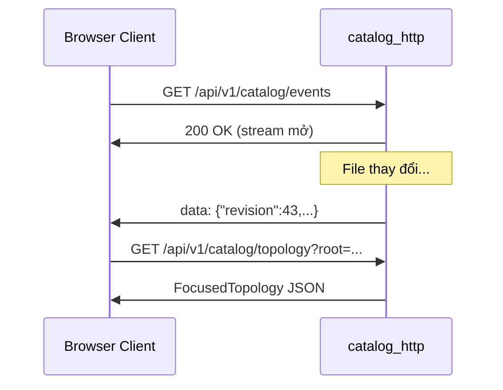

# :material-broadcast: Server-Sent Events

`CatalogChangeFeed` phát SSE events khi `CatalogWorkspace` revision thay đổi. Browser client kết nối endpoint này để nhận cập nhật real-time.

---

## :material-connection: Endpoint

```
GET /api/v1/catalog/events
Content-Type: text/event-stream
```

---

## :material-email-outline: Format Event

```
data: {"revision":43,"changed_source_uris":["file:///path/to/catalog-info.yaml"],"removed_source_uris":[]}

data: {"revision":44,"changed_source_uris":[],"removed_source_uris":["file:///old/catalog-info.yaml"]}
```

| Field | Type | Mô tả |
|---|---|---|
| `revision` | `integer` | Revision mới của `CatalogWorkspace` |
| `changed_source_uris` | `string[]` | URI của document thay đổi |
| `removed_source_uris` | `string[]` | URI của document bị xóa |

---

## :material-strategy: Cách sử dụng



!!! tip "Metadata only"
    Event payload chỉ chứa metadata (revision + URIs), **không** chứa semantic delta. Client nhận event → **refetch** `CatalogSnapshot` hoặc `FocusedTopology` mới.

---

## :material-link: Đọc thêm

- [Tham chiếu Endpoints](endpoints.md)
- [`CatalogFileWatcher`](../backend/file-watcher.md)
