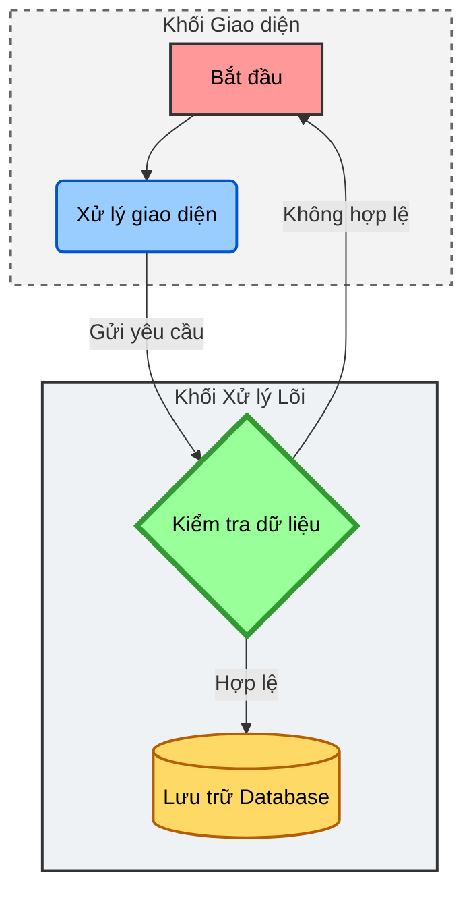

# Hướng dẫn vẽ biểu đồ Mermaid cơ bản

Dưới đây là một khối Mermaid kết hợp giữa việc tạo **Node nhiều màu sắc** và nhóm chúng lại bằng **Subgraph** (Thư mục/Nhóm logic):

### Giải thích cú pháp Subgraph:
1. `subgraph Tên_ID [Tiêu đề hiển thị]`: Khởi tạo một cụm chức năng (khối).
2. Viết các Node bên trong `subgraph` ... `end` để gộp chúng lại với nhau trong một hộp chứa (box).
3. Bạn có thể kéo mũi tên từ một Node trong Subgraph này sang một Node ở Subgraph khác hoàn toàn bình thường (như `Node2 --> Node3`).
4. Bạn cũng có thể dùng `style Tên_ID_Subgraph` để đổi màu nền và viền cho chính cái hộp chứa đó (như tôi đã thêm nét đứt `stroke-dasharray` cho khối Frontend).
