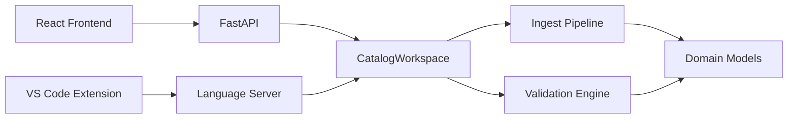

# :material-wall: Module Boundaries

Each component in the IDP Platform has clear rules about what it can and cannot do. These rules prevent bugs and keep the codebase easy to understand.

---

## The Core Rule

!!! important "Python owns all catalog logic"
    All validation, normalization, identity resolution, and relation projection happens in Python. TypeScript components (frontend, VS Code extension) **must never** re-implement any of these rules.

This means:

- ✅ TypeScript can display data it receives from Python
- ✅ TypeScript can format, filter, and search data for display
- ❌ TypeScript must **never** validate a descriptor
- ❌ TypeScript must **never** compute an entity reference
- ❌ TypeScript must **never** decide if a relation is healthy or broken

---

## Component Boundary Rules

### CatalogWorkspace (`backend/app/catalog_workspace/`)

| Allowed | Not Allowed |
|---------|-------------|
| Parse, normalize, validate descriptors | Read files from disk directly |
| Track entities, relations, conflicts, drafts | Know about HTTP, FastAPI, or REST |
| Compute focused topology | Know about LSP protocol |
| Generate diagnostics | Know about file paths or OS details |
| Manage revision numbers | Send notifications to clients |

The CatalogWorkspace receives raw bytes and produces structured data. It does not know where the bytes come from (filesystem, HTTP, editor buffer).

### Local Catalog Runtime (`backend/app/local_catalog/`)

| Allowed | Not Allowed |
|---------|-------------|
| Discover `catalog-info.yaml` files on disk | Validate descriptor content |
| Watch for filesystem changes | Normalize entity references |
| Pass file content to CatalogWorkspace | Compute relations |
| Serve HTTP API endpoints | Know about VS Code or LSP |
| Publish SSE change notifications | Modify CatalogWorkspace internals |

### Language Server (`backend/app/catalog_language_server/`)

| Allowed | Not Allowed |
|---------|-------------|
| Handle LSP protocol messages | Validate descriptor content |
| Pass editor buffer to CatalogWorkspace | Normalize entity references |
| Convert diagnostics to LSP format | Serve HTTP endpoints |
| Respond to topology requests | Access the filesystem directly |
| Debounce unsaved changes | Know about FastAPI or REST |

### Frontend (`frontend/src/`)

| Allowed | Not Allowed |
|---------|-------------|
| Display topology graph using ReactFlow | Validate descriptors |
| Fetch data from the HTTP API | Compute entity references |
| Search entities by name | Re-implement validation logic |
| Show health/freshness visual states | Modify catalog state |

### VS Code Extension (`vscode-extension/src/`)

| Allowed | Not Allowed |
|---------|-------------|
| Start/stop the Language Server | Validate descriptors |
| Show LSP diagnostics in the editor | Parse YAML files |
| Display topology in a webview panel | Compute relations |
| Respond to VS Code commands | Access the HTTP API |

---

## Dependency Direction

Dependencies always point **inward** — from the outer layers toward the core:

!!! warning "No reverse dependencies"
    The core modules (`catalog_workspace`, `ingest`, `validators`, `domain`) must **never** import from the adapter or presentation layers. If you see `from app.local_catalog import ...` inside `workspace.py`, that is a bug.

---

## Further Reading

- [System Overview](overview.md) — All components and the repository structure
- [Data Flow](data-flow.md) — How data moves through the layers
