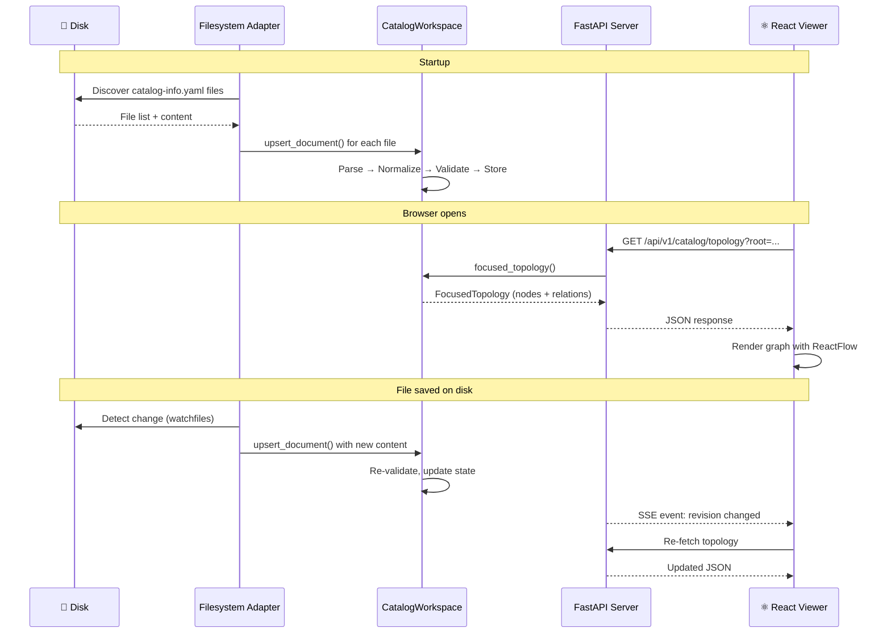
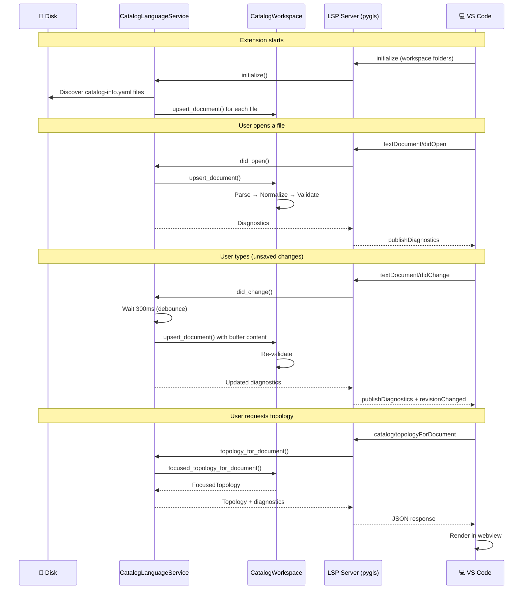
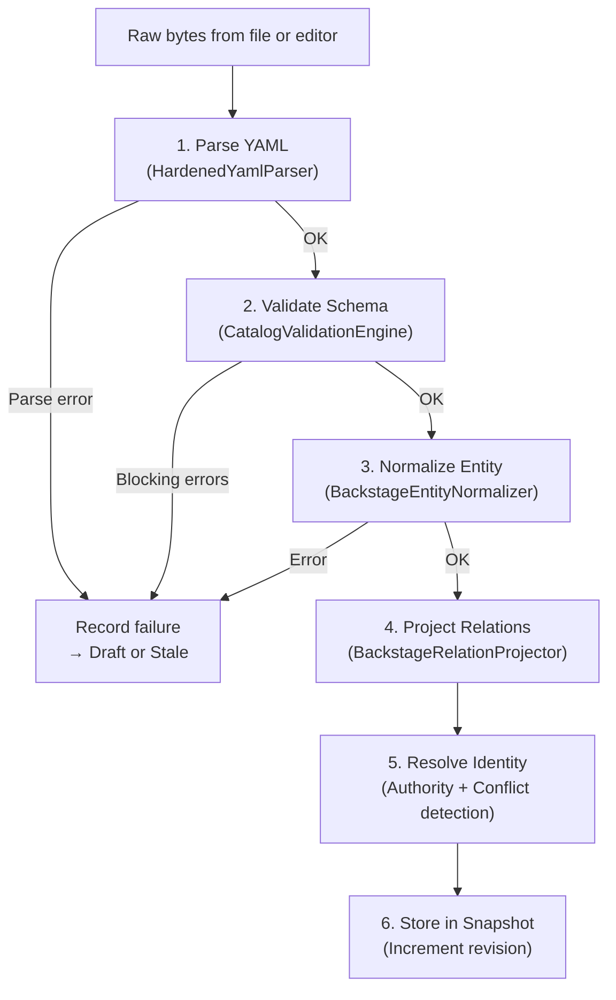

# :material-pipe: Data Flow

This page shows exactly how data moves through the system — from a `catalog-info.yaml` file on your disk to the topology graph in your browser or editor.

---

## Browser Data Flow

When you use the browser viewer, data flows through the **HTTP stack**:

---

## VS Code Data Flow

When you use the VS Code extension, data flows through the **LSP stack**:

---

## Document Processing Pipeline

Every time a document enters the system (from disk or editor), it goes through the same pipeline:

### What happens at each step:

| Step | Module | Input | Output |
|------|--------|-------|--------|
| 1. Parse | `HardenedYamlParser` | Raw bytes | Python dict (or parse error) |
| 2. Validate | `CatalogValidationEngine` | Python dict | `ValidationOutcome` with issues |
| 3. Normalize | `BackstageEntityNormalizer` | Python dict | Typed `Entity` with canonical ref |
| 4. Project | `BackstageRelationProjector` | `Entity` | List of `Relation` objects |
| 5. Resolve | `CatalogWorkspace` | `Entity` + ref | Update candidate map, detect conflicts |
| 6. Store | `CatalogWorkspace` | Everything | Increment revision counter |

---

## What Happens When a File Changes

When the file watcher detects a change to a `catalog-info.yaml` file:

1. **Debounce** — Wait 300 ms in case more changes are coming
2. **Read** — Read the file content from disk
3. **Process** — Run the full pipeline above (parse → validate → normalize → project → resolve)
4. **Notify** — Publish a `CatalogChangeNotification` with the new revision and affected URIs
5. **SSE** — The HTTP API sends the notification to any connected browser via Server-Sent Events
6. **LSP** — The Language Server sends a `catalog/revisionChanged` notification to VS Code

---

## Further Reading

- [CatalogWorkspace](../backend/catalog-workspace.md) — How the core module processes documents
- [Ingest Pipeline](../backend/ingest-pipeline.md) — Details of parsing, normalization, and projection
- [State Management](state.md) — How entities, drafts, and conflicts are tracked
