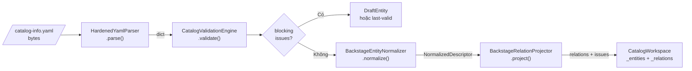
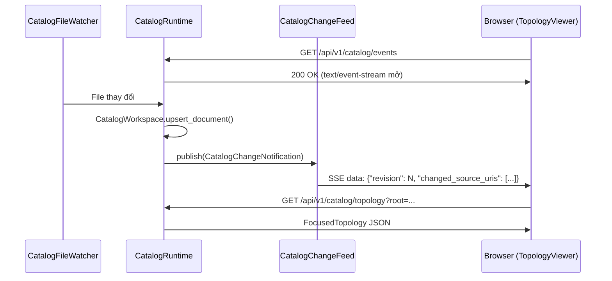
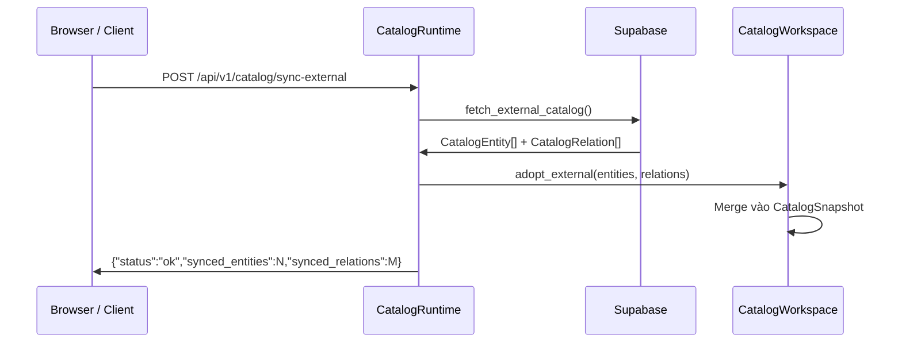

# :material-transit-connection-variant: Luồng dữ liệu

## :material-file-upload-outline: Ingest Pipeline

Khi file `catalog-info.yaml` được phát hiện hoặc thay đổi, nó đi qua pipeline xử lý:

---

## :material-step-forward: Chi tiết từng giai đoạn

### Giai đoạn 1 — YAML Parsing (`HardenedYamlParser`)

**Đầu vào:** `bytes` · **Đầu ra:** `dict[str, object]`

Parser áp dụng **YAML 1.2 JSON-compatible subset** nghiêm ngặt:

| Quy tắc | Mã lỗi |
|---|---|
| Từ chối YAML alias (ngăn circular reference) | `YAML_ALIAS_UNSUPPORTED` |
| Từ chối mapping key không phải string | `YAML_NON_STRING_KEY` |
| Từ chối duplicate mapping key | `YAML_DUPLICATE_KEY` |
| Từ chối timestamp bare value | `YAML_TIMESTAMP_UNSUPPORTED` |
| Từ chối NaN/Infinity | `YAML_NON_FINITE_NUMBER` |
| Yêu cầu đúng 1 document | `YAML_MULTIPLE_DOCUMENTS` |
| Root phải là mapping | `YAML_ROOT_NOT_MAPPING` |

---

### Giai đoạn 2 — Schema Validation (`CatalogValidationEngine`)

**Đầu vào:** `dict[str, object]` · **Đầu ra:** `list[ValidationIssue]`

`CatalogValidationEngine` phát hiện descriptor là **VSF IDP v2** (có `specVersion: vsf-idp.io/v2`) hay **Backstage**, rồi áp dụng schema tương ứng.

=== "VSF IDP v2"

    | Trường | Quy tắc |
    |---|---|
    | `specVersion` | Phải chính xác `"vsf-idp.io/v2"` |
    | `metadata.namespace` | Bắt buộc, khớp `^[a-z][a-z0-9-]*$` |
    | `metadata.system` | Bắt buộc, khớp `^[a-z][a-z0-9-]*$`, phải tồn tại trong catalog |
    | `metadata.domain` | Bắt buộc, ≤ 128 ký tự in được |
    | `spec.id` | Bắt buộc, khớp `^[a-z][a-z0-9-]*$` |
    | `spec.name` | Bắt buộc, không chứa ký tự điều khiển |
    | `spec.type` | Một trong 13 loại hỗ trợ (`service`, `gateway`, `worker`, ...) |
    | `spec.owners.members` | Có thể rỗng; nếu không rỗng phải có ít nhất 1 `techlead` |
    | `spec.owners.members[*].user` | Phải là email `*@vinsmartfuture.tech` |
    | `spec.review.branch` | Bắt buộc cho `spec.type` = `service` hoặc `gateway` |
    | `spec.topology[*]` | Mỗi item phải có `ref`; tuỳ chọn `protocol`, `reason` |

=== "Backstage"

    | Trường | Quy tắc |
    |---|---|
    | `apiVersion` | Bắt buộc, chuỗi không rỗng |
    | `kind` | Bắt buộc, chuỗi không rỗng |
    | `metadata` | Bắt buộc, phải là object |
    | `metadata.name` | Bắt buộc, chuỗi không rỗng |
    | `spec` | Nếu có, phải là object |

---

### Giai đoạn 3 — Normalization (`BackstageEntityNormalizer`)

**Đầu vào:** `dict[str, object]` · **Đầu ra:** `NormalizedDescriptor`

- Tính canonical `EntityReference` (`kind:namespace/name`)
- Chuẩn hoá tất cả reference string trong `spec` sang dạng canonical
- Xử lý cả VSF v2 (chuyển đổi `metadata.*` → Backstage-compatible fields) và Backstage

---

### Giai đoạn 4 — Relation Projection (`BackstageRelationProjector`)

**Đầu vào:** `NormalizedDescriptor` · **Đầu ra:** `ProjectionResult(relations, issues, declarations)`

Chiếu spec fields thành `Relation` objects với `RelationType`:

| Spec Field | `RelationType` | Default Kind |
|---|---|---|
| `spec.system` | `partOf` | `system` |
| `spec.domain` | `partOf` | `domain` |
| `spec.parent` | `partOf` | `group` |
| `spec.dependsOn[]` | `dependsOn` | `component` |
| `spec.providesApis[]` | `providesApi` | `api` |
| `spec.consumesApis[]` | `consumesApi` | `api` |
| `spec.publishesTo[]` | `publishesTo` | `event` |
| `spec.consumesFrom[]` | `consumesFrom` | `event` |
| `spec.topology[].ref` (VSF v2) | Từ prefix `type:ref` | Theo `TOPOLOGY_FIELDS` |

---

## :material-broadcast: Luồng SSE Event

---

## :material-cloud-sync: Luồng External Catalog

---

## :material-link: Đọc thêm

- [Ingest Pipeline chi tiết](../backend/ingest-pipeline.md)
- [CatalogValidationEngine](../backend/validation.md)
- [SSE Events API](../api/events.md)
