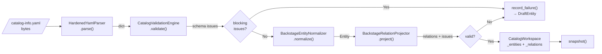
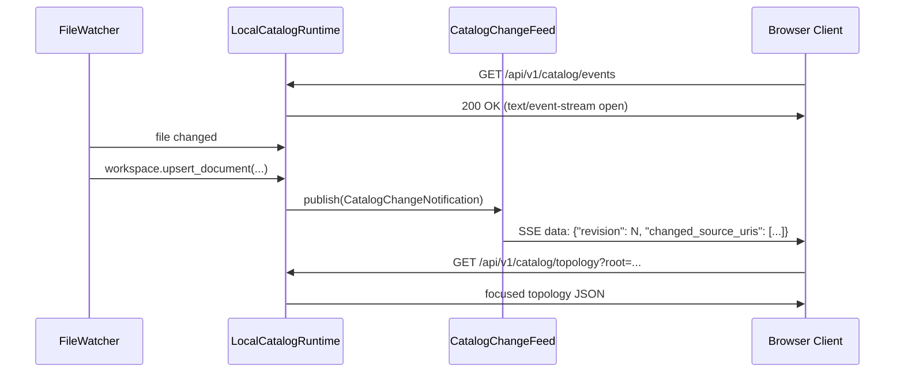

# :material-transit-connection-variant: Data Flow

## :material-file-upload-outline: Document Ingest Flow

When a `catalog-info.yaml` file is discovered or updated, it flows through a strict pipeline:

---

## :material-step-forward: Stage Details

### Stage 1: YAML Parsing — `HardenedYamlParser`

**Input:** `bytes`
**Output:** `dict[str, object]`

The parser applies a **strict YAML 1.2 JSON-compatible subset**:

- Rejects YAML aliases (circular reference prevention)
- Rejects non-string mapping keys
- Rejects duplicate mapping keys
- Rejects timestamps as bare values (must be quoted strings)
- Rejects NaN/Infinity floating-point values
- Rejects multi-document YAML files (must have exactly one document)
- Requires the root to be a mapping, not a sequence or scalar

**Error codes:** `YAML_INVALID_UTF8`, `YAML_SYNTAX_ERROR`, `YAML_MULTIPLE_DOCUMENTS`, `YAML_ROOT_NOT_MAPPING`, `YAML_ALIAS_UNSUPPORTED`, `YAML_NON_STRING_KEY`, `YAML_DUPLICATE_KEY`, `YAML_TAG_UNSUPPORTED`, `YAML_TIMESTAMP_UNSUPPORTED`, `YAML_NON_FINITE_NUMBER`

---

### Stage 2: Schema Validation — `CatalogValidationEngine`

**Input:** `dict[str, object]`
**Output:** list of `ValidationIssue`

Detects whether the descriptor is **VSF IDP v2** (`specVersion: vsf-idp.io/v2`) or **Backstage** format, then applies the appropriate schema rules.

=== "VSF IDP v2"

    | Field | Rule |
    |-------|------|
    | `specVersion` | Must be exactly `"vsf-idp.io/v2"` |
    | `metadata.namespace` | Required, matches `^[a-z][a-z0-9-]*$` |
    | `metadata.system` | Required, matches `^[a-z][a-z0-9-]*$` |
    | `metadata.domain` | Required, ≤ 128 printable chars |
    | `spec.id` | Required, matches `^[a-z][a-z0-9-]*$` |
    | `spec.name` | Required, no control characters |
    | `spec.type` | One of 13 supported types (service, gateway, worker, …) |
    | `spec.owners.members` | At least one member; at least one `techlead` role |
    | `spec.owners.members[*].user` | Must be `*@vinsmartfuture.tech` email |
    | `spec.review.branch` | Required for `service` and `gateway` types |
    | `spec.topology[*]` | Each item must have `ref`; optional `protocol`, `reason` |

=== "Backstage"

    | Field | Rule |
    |-------|------|
    | `apiVersion` | Required, non-blank string |
    | `kind` | Required, non-blank string |
    | `metadata` | Required object |
    | `metadata.name` | Required, non-blank string |
    | `spec` | If present, must be an object |

---

### Stage 3: Normalization — `BackstageEntityNormalizer`

**Input:** `dict[str, object]`
**Output:** `Entity` (Pydantic model)

- Computes the canonical `EntityReference` (`kind:namespace/name`)
- Normalizes all reference strings in `spec` to canonical form
- Strips internal fields before caching the descriptor

---

### Stage 4: Relation Projection — `BackstageRelationProjector`

**Input:** `Entity`
**Output:** `ProjectionResult(relations, issues)`

Projects declared spec fields into typed `Relation` objects:

| Spec Field | Relation Type | Target Kind |
|-----------|--------------|-------------|
| `spec.system` | `partOf` | `system` |
| `spec.domain` | `partOf` | `domain` |
| `spec.parent` | `partOf` | `group` |
| `spec.dependsOn[]` | `dependsOn` | `component` |
| `spec.providesApis[]` | `providesApi` | `api` |
| `spec.consumesApis[]` | `consumesApi` | `api` |
| `spec.publishesTo[]` | `publishesTo` | `event` |
| `spec.consumesFrom[]` | `consumesFrom` | `event` |
| `spec.topology[].ref` (VSF v2) | type from prefix | varies |

---

## :material-broadcast: SSE Event Flow

---

## :material-link: Further Reading

- [Ingest Pipeline Deep Dive](../backend/ingest-pipeline.md)
- [Validation Engine](../backend/validation.md)
- [SSE Events API](../api/events.md)
- [YAML 1.2 Specification](https://yaml.org/spec/1.2.2/)
