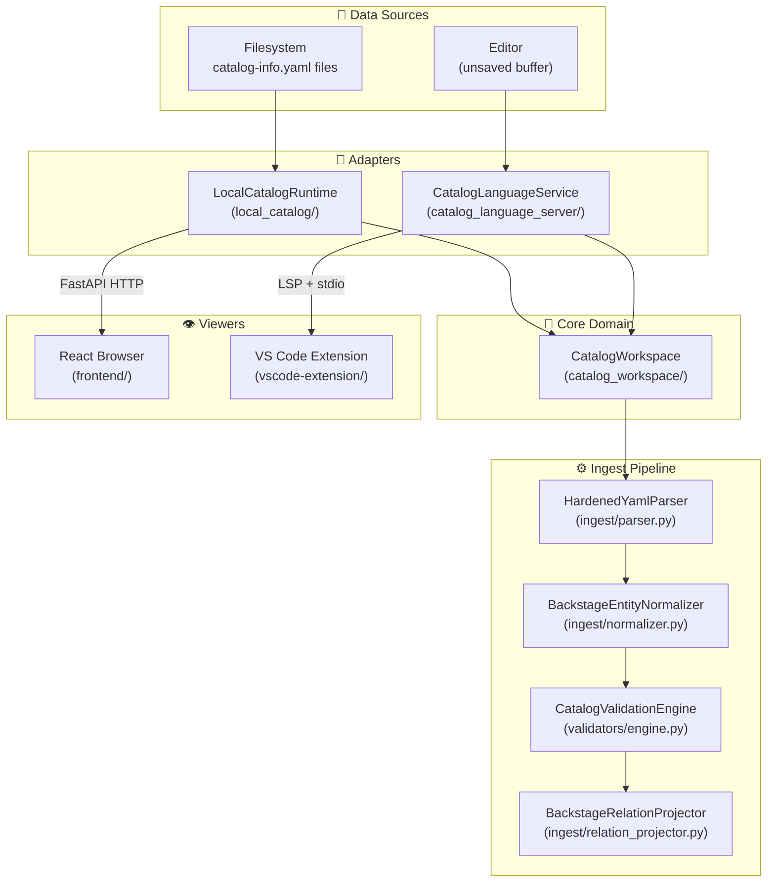
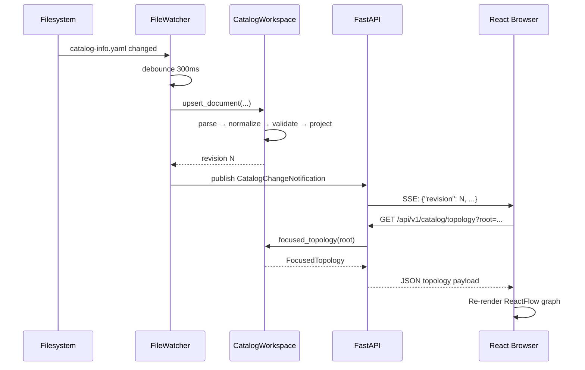

# :material-sitemap: Architecture Overview

The IDP Platform follows a **layered adapter architecture** with a single, deep domain module (`CatalogWorkspace`) at the center.

---

## :material-layers-outline: Layered Design



---

## :material-cube-outline: Component Responsibilities

### :material-brain: `CatalogWorkspace` — The Deep Module

The core of the system. All catalog semantics live here.

**Responsibilities:**

- YAML parsing (via `HardenedYamlParser`)
- Entity normalization and canonical reference computation
- Schema and topology validation
- Relation projection (declaring which entity references what)
- Conflict detection (duplicate canonical identity)
- Last-valid state management (stale/draft entities)
- Focused one-hop topology traversal
- Diagnostic aggregation

**Key API:**

```python
workspace = CatalogWorkspace.open(scope)
workspace.upsert_document(source_uri=..., relative_path=..., content=...)
workspace.remove_document(source_uri=...)
snapshot = workspace.snapshot()
topology = workspace.focused_topology(root, direction="both", depth=1)
diagnostics = workspace.diagnostics()
```

---

### :material-server: `LocalCatalogRuntime` — HTTP Adapter

Wraps `CatalogWorkspace` for the browser flow.

- Discovers `catalog-info.yaml` files at startup via `discover_catalog_descriptors()`
- Runs a `CatalogFileWatcher` to pick up file-system changes
- Exposes a `CatalogChangeFeed` for real-time SSE notifications
- Creates the FastAPI application via `create_local_catalog_app()`

---

### :material-language-python: `CatalogLanguageService` — LSP Adapter

Wraps `CatalogWorkspace` for the VS Code editor flow.

- Responds to standard LSP lifecycle events (`initialize`, `didOpen`, `didChange`, `didSave`, `didClose`)
- Maintains **unsaved editor overlays**: in-memory buffers that shadow on-disk files
- Publishes LSP diagnostics (`textDocument/publishDiagnostics`) after 300 ms debounce
- Responds to custom `catalog/topologyForDocument` requests
- Emits `catalog/revisionChanged` notifications

---

### :material-react: Frontend — Presentation Layer

Pure React + ReactFlow presentation. No catalog rules are implemented here.

- Fetches focused topology from `/api/v1/catalog/topology`
- Renders nodes with visual state badges (healthy, warning, error, stale, draft, conflict)
- Provides catalog-wide search over the full snapshot
- Subscribes to SSE events and auto-refreshes the view

---

### :material-microsoft-visual-studio-code: VS Code Extension — Host

Orchestrates the editor experience. No catalog rules.

- Launches the Python LSP server (`python -m app.catalog_language_server`)
- Manages the webview panel and posts topology data to the React component
- Handles active-editor following and pin state
- Cancels superseded in-flight requests
- Validates webview message shapes before processing

---

## :material-arrow-decision-outline: Data Flow



---

## :material-link: References

- [Architecture reference doc](../architecture/overview.md)
- [Boundaries and constraints](../architecture/boundaries.md)
- [FastAPI Documentation](https://fastapi.tiangolo.com/)
- [Language Server Protocol Specification](https://microsoft.github.io/language-server-protocol/specifications/lsp/3.17/specification/)
- [Backstage Architecture Decision Records](https://backstage.io/docs/architecture-decisions/)
