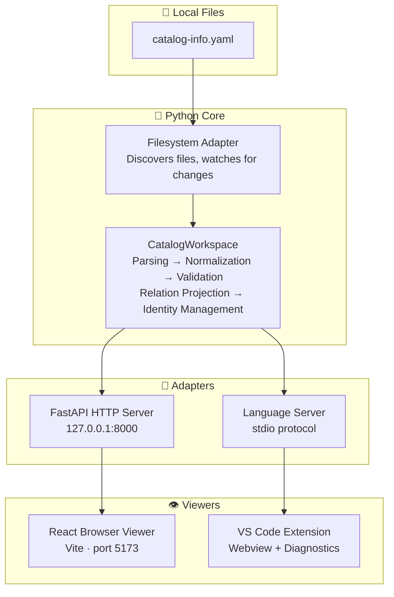

# :material-sitemap: Architecture

The IDP Platform follows a simple rule: **Python owns all catalog logic, TypeScript owns all display.**

This section explains how the system is organized and how data flows through it.

---

-   :material-view-dashboard-outline:{ .lg .middle } **System Overview**

    All components, their roles, and the repository structure.

    [:octicons-arrow-right-24: System Overview](overview.md)

-   :material-wall:{ .lg .middle } **Module Boundaries**

    Rules about what each component is allowed to do.

    [:octicons-arrow-right-24: Module Boundaries](boundaries.md)

-   :material-pipe:{ .lg .middle } **Data Flow**

    How a `catalog-info.yaml` file goes from disk to the screen.

    [:octicons-arrow-right-24: Data Flow](data-flow.md)

-   :material-state-machine:{ .lg .middle } **State Management**

    How the system manages entities, drafts, conflicts, and stale data.

    [:octicons-arrow-right-24: State Management](state.md)

