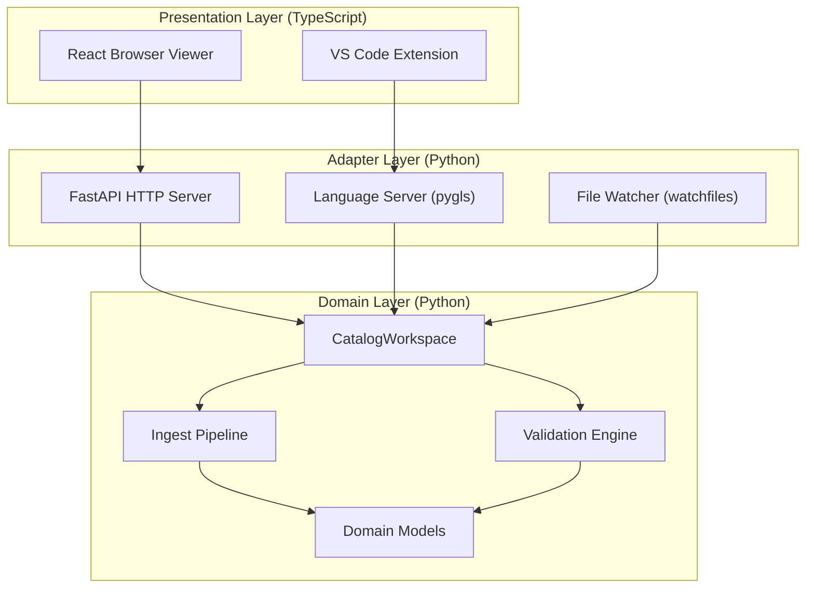

# :material-view-dashboard-outline: System Overview

The IDP Platform has **eight main components** spread across Python and TypeScript.

---

## Component Map

| Component | Location | Language | What it does |
|-----------|----------|----------|-------------|
| **CatalogWorkspace** | `backend/app/catalog_workspace/` | Python | The core engine — handles all catalog logic |
| **Ingest Pipeline** | `backend/app/ingest/` | Python | Parses YAML, normalizes entities, projects relations |
| **Validation Engine** | `backend/app/validators/` | Python | Checks descriptors for errors (schema, references, topology) |
| **Domain Models** | `backend/app/domain/` | Python | Shared data types: Entity, EntityReference, RelationType |
| **Local Catalog Runtime** | `backend/app/local_catalog/` | Python | HTTP server (FastAPI) + file watcher |
| **Language Server** | `backend/app/catalog_language_server/` | Python | LSP server for VS Code integration |
| **Frontend** | `frontend/src/` | TypeScript + React | Browser-based topology viewer |
| **VS Code Extension** | `vscode-extension/src/` | TypeScript | Editor integration with diagnostics and webview |

---

## Layer Diagram

The system has three layers. Each layer only talks to the layer directly below it:



!!! info "Why this separation matters"
    Because Python owns all catalog logic, the browser viewer and VS Code extension always produce **the same results**. You cannot have a situation where the browser shows a valid entity but VS Code shows an error (or vice versa).

---

## Repository Structure

```
idp-platform/
├── .env.example                    # Environment variable template
├── mkdocs.yml                      # Documentation configuration
│
├── backend/                        # Python backend
│   ├── requirements.txt            # Production dependencies
│   ├── requirements-dev.txt        # Test/lint dependencies
│   └── app/
│       ├── catalog_workspace/      # ★ Core domain — all catalog logic
│       │   ├── models.py           # Data types: CatalogEntity, Snapshot, Topology
│       │   ├── workspace.py        # CatalogWorkspace class (580 lines)
│       │   └── source_positions.py # Maps field paths to line/column numbers
│       ├── ingest/                 # YAML parsing and normalization
│       │   ├── parser.py           # HardenedYamlParser — safe YAML parsing
│       │   ├── normalizer.py       # BackstageEntityNormalizer — entity normalization
│       │   └── relation_projector.py  # BackstageRelationProjector — relation extraction
│       ├── validators/             # Validation engine
│       │   ├── engine.py           # CatalogValidationEngine (schema + topology)
│       │   ├── registry.py         # 22 diagnostic code definitions
│       │   └── schemas.py          # ValidationIssue, ValidationReport types
│       ├── domain/                 # Shared domain types
│       │   ├── entity.py           # Entity Pydantic model
│       │   ├── enums/relation_type.py  # RelationType enum (7 types)
│       │   └── value_objects/
│       │       ├── entity_reference.py  # EntityReference: kind:namespace/name
│       │       └── relation.py          # Relation value object
│       ├── local_catalog/          # HTTP runtime
│       │   ├── __main__.py         # Entry: python -m app.local_catalog
│       │   ├── api.py              # FastAPI routes (7 endpoints)
│       │   ├── runtime.py          # LocalCatalogRuntime startup
│       │   ├── filesystem.py       # Recursive catalog-info.yaml discovery
│       │   ├── watcher.py          # CatalogFileWatcher with debounce
│       │   └── events.py           # SSE change notification feed
│       └── catalog_language_server/  # LSP server
│           ├── __main__.py         # Entry: python -m app.catalog_language_server
│           ├── server.py           # pygls server with LSP handlers
│           └── service.py          # CatalogLanguageService — editor integration
│
├── frontend/                       # React browser viewer
│   ├── package.json                # React 19, ReactFlow 11, Vite 7
│   └── src/
│       ├── main.tsx                # React entry point
│       ├── topology/               # Topology graph components
│       │   ├── TopologyViewer.tsx   # Main viewer component
│       │   ├── catalogSearch.ts     # Full-text entity search
│       │   └── types.ts             # TypeScript types
│       └── localCatalog/            # API client
│           ├── HttpLocalCatalogClient.ts  # HTTP client for the backend
│           └── types.ts              # Response types
│
├── vscode-extension/               # VS Code extension
│   ├── package.json                # Extension manifest and commands
│   └── src/
│       ├── extension.ts            # activate/deactivate entry
│       ├── host/controller.ts      # Extension lifecycle controller
│       ├── vscode/                 # VS Code API adapters
│       │   ├── vscodeHost.ts       # VS Code API wrapper
│       │   ├── vscodeLanguageClient.ts  # LSP client
│       │   └── webviewHtml.ts      # Webview HTML generator
│       └── webview/                # Topology webview app
│           ├── WebviewApp.tsx      # React app for the webview
│           └── protocol.ts         # Message protocol host ↔ webview
│
├── openapi/
│   └── openapi.yaml               # OpenAPI 3.1 HTTP contract
│
├── contracts/
│   └── examples/                   # JSON fixtures for contract tests
│
└── site/docs/                      # This documentation
```

---

## Further Reading

- [Module Boundaries](boundaries.md) — Rules each component must follow
- [Data Flow](data-flow.md) — How data moves through the system
- [State Management](state.md) — How entities, drafts, and conflicts are tracked
