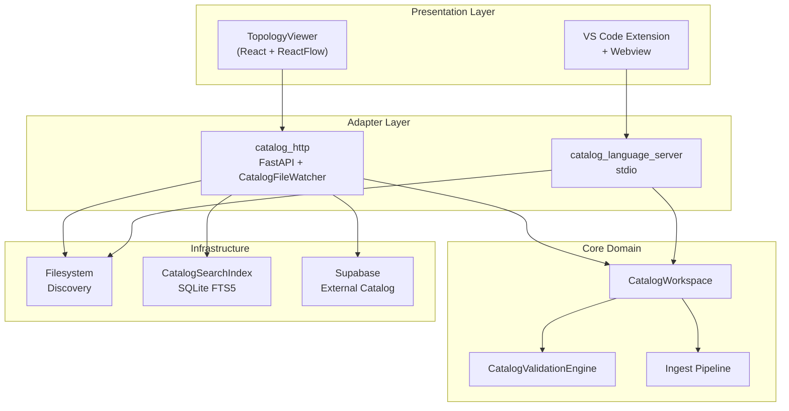

# :material-view-dashboard-outline: Tổng quan hệ thống

## :material-package-variant: Bản đồ thành phần

| Thành phần | Đường dẫn | Ngôn ngữ | Vai trò |
|---|---|---|---|
| **`CatalogWorkspace`** | `backend/app/catalog_workspace/` | Python | Core domain: toàn bộ catalog semantics |
| **Ingest Pipeline** | `backend/app/ingest/` | Python | `HardenedYamlParser`, `BackstageEntityNormalizer`, `BackstageRelationProjector` |
| **`CatalogValidationEngine`** | `backend/app/validators/` | Python | Schema validation (VSF v2 + Backstage) và topology validation |
| **Domain Models** | `backend/app/domain/` | Python | `EntityReference`, `RelationType`, `NormalizedDescriptor` |
| **`catalog_infra`** | `backend/app/catalog_infra/` | Python | `CatalogSearchIndex`, filesystem discovery, Supabase sync, completion |
| **`catalog_http`** | `backend/app/catalog_http/` | Python | FastAPI, `CatalogRuntime`, `CatalogFileWatcher`, `CatalogChangeFeed`, entity writes |
| **`catalog_language_server`** | `backend/app/catalog_language_server/` | Python | `CatalogLanguageServer` (pygls) + `CatalogLanguageService` qua stdio |
| **Frontend** | `frontend/src/` | TypeScript + React | `TopologyViewer`, `HttpCatalogClient`, catalog search |
| **VS Code Extension** | `vscode-extension/src/` | TypeScript | Editor host + LSP client + webview |
| **OpenAPI Contract** | `openapi/openapi.yaml` | YAML | Wire contract cho HTTP API |

---

## :material-layers-outline: Sơ đồ tầng (Layer Diagram)



---

## :material-file-tree: Cấu trúc Repository

```
idp-platform/
├── .env.example                    # Template biến môi trường
├── mkdocs.yml                      # Cấu hình documentation
│
├── backend/
│   ├── requirements.txt            # Production dependencies
│   ├── requirements-dev.txt        # Dev + test dependencies
│   ├── pyproject.toml
│   └── app/
│       ├── catalog_workspace/      # ★ Core domain module
│       │   ├── models.py           # CatalogEntity, CatalogSnapshot, FocusedTopology
│       │   ├── workspace.py        # CatalogWorkspace implementation
│       │   └── source_positions.py # Field-path → line/column mapping
│       ├── ingest/
│       │   ├── parser.py           # HardenedYamlParser (YAML 1.2 JSON-subset)
│       │   ├── normalizer.py       # BackstageEntityNormalizer
│       │   └── relation_projector.py  # BackstageRelationProjector
│       ├── validators/
│       │   ├── engine.py           # CatalogValidationEngine
│       │   ├── registry.py         # ValidationIssue factory
│       │   └── schemas.py          # ValidationIssue, ValidationReport
│       ├── domain/
│       │   ├── descriptor.py       # NormalizedDescriptor (Pydantic model)
│       │   ├── enums/relation_type.py  # RelationType enum
│       │   └── value_objects/
│       │       ├── entity_reference.py  # EntityReference (kind:namespace/name)
│       │       └── relation.py          # Relation value object
│       ├── catalog_infra/
│       │   ├── filesystem.py       # catalog-info.yaml discovery
│       │   ├── search_index.py     # CatalogSearchIndex (SQLite FTS5)
│       │   ├── completion.py       # Catalog-aware completion
│       │   └── supabase_sync.py    # External catalog fetch (read-only)
│       ├── catalog_http/
│       │   ├── __main__.py         # Entry point: python -m app.catalog_http
│       │   ├── api.py              # FastAPI application factory
│       │   ├── runtime.py          # CatalogRuntime
│       │   ├── entity_writes.py    # Supabase write path
│       │   ├── watcher.py          # CatalogFileWatcher
│       │   └── events.py           # CatalogChangeFeed (SSE pub/sub)
│       └── catalog_language_server/
│           ├── __main__.py         # Entry point: python -m app.catalog_language_server
│           ├── server.py           # CatalogLanguageServer (pygls)
│           └── service.py          # CatalogLanguageService
│
├── frontend/
│   ├── package.json
│   ├── vite.config.ts
│   └── src/
│       ├── main.tsx
│       ├── app/App.tsx
│       ├── catalog/
│       │   ├── HttpCatalogClient.ts   # HTTP API client
│       │   ├── CatalogProvider.tsx     # React context
│       │   └── types.ts               # TypeScript types
│       └── topology/
│           ├── TopologyViewer.tsx      # Main component
│           ├── topologyLayout.ts      # Graph layout algorithm
│           ├── localContract.ts       # API type mapping
│           └── catalogSearch.ts       # Search logic
│
├── vscode-extension/
│   ├── package.json                # Extension manifest
│   └── src/
│       ├── extension.ts            # activate/deactivate
│       └── host/controller.ts      # Extension orchestrator
│
├── openapi/
│   └── openapi.yaml                # OpenAPI 3.1 contract
│
├── contracts/
│   └── examples/                   # Contract-tested JSON fixtures
│
└── site/docs/                      # ← Toàn bộ tài liệu
```

---

## :material-link: Đọc thêm

- [Ranh giới Module](boundaries.md)
- [Luồng dữ liệu](data-flow.md)
- [Quản lý trạng thái](state.md)
