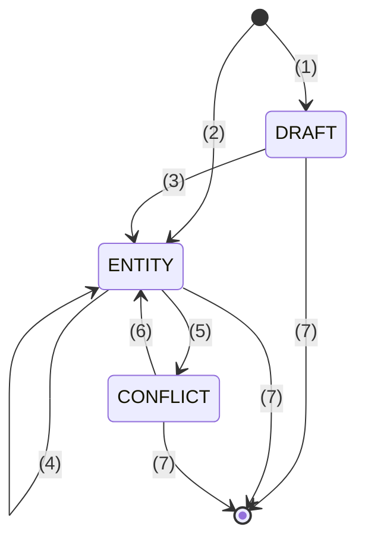
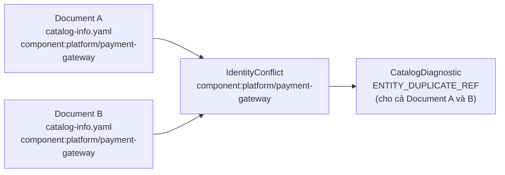

# :material-state-machine: Quản lý trạng thái

## :material-swap-horizontal: Sơ đồ chuyển đổi `TopologyNodeState`

Mỗi entity reference trong hệ thống tồn tại ở một trong bốn trạng thái:

**Chú thích các sự kiện chuyển đổi:**

- **(1) Khởi tạo lỗi:** File `catalog-info.yaml` lần đầu được thêm vào hệ thống nhưng không qua được bước Validation.
- **(2) Khởi tạo hợp lệ:** File được tạo mới và vượt qua toàn bộ bước Parse & Validate.
- **(3) Khắc phục lỗi:** Lập trình viên sửa một file đang DRAFT thành một file hợp lệ.
- **(4) Cập nhật:** Chỉnh sửa một file hợp lệ. *(Lưu ý: Nếu cập nhật bản mới bị lỗi, hệ thống sẽ từ chối áp dụng, tiếp tục duy trì trạng thái ENTITY của bản hợp lệ cuối cùng — gọi là Last-Valid)*.
- **(5) Trùng lặp:** Một file thứ 2 xuất hiện, có cùng định danh (`kind:namespace/name`) với entity hiện tại.
- **(6) Giải quyết:** Xóa bớt hoặc đổi tên một trong những file gây xung đột.
- **(7) Xóa bỏ:** File bị xóa khỏi hệ thống.

---

## :material-tag-multiple: Bốn trạng thái `TopologyNodeState`

| Trạng thái | Enum Value | Mô tả | `Health` | `Freshness` |
|---|---|---|---|---|
| **ENTITY** | `entity` | `CatalogEntity` đã resolve, có `NormalizedDescriptor` hợp lệ | `healthy` / `error` | `current` / `stale` |
| **DRAFT** | `draft` | Document chưa bao giờ tạo ra `NormalizedDescriptor` hợp lệ | `error` | `current` |
| **CONFLICT** | `conflict` | Hai+ document claim cùng canonical `EntityReference` | `error` | `current` |
| **UNRESOLVED** | `unresolved` | Target của `Relation` không tìm thấy trong `CatalogSnapshot` | `warning` | `current` |

---

## :material-history: Last-valid State

Khi document đã từng valid (tức `CatalogEntity` đã tồn tại trong `CatalogSnapshot`) nhưng bản chỉnh sửa mới bị lỗi validation:

1. `CatalogWorkspace` **giữ lại** `CatalogEntity` cuối cùng hợp lệ
2. Đánh dấu `Health.error` và `Freshness.stale`
3. `CatalogRelation` của entity này vẫn hiển thị trong `FocusedTopology`
4. `CatalogDiagnostic` báo lỗi cho document hiện tại

Hành vi này đảm bảo topology graph không "biến mất" khi đang chỉnh sửa file — người dùng vẫn thấy node (với trạng thái lỗi) trong khi sửa.

---

## :material-alert: `IdentityConflict`

Khi hai document claim cùng canonical reference (ví dụ `component:platform/payment-gateway`):

- Cả hai candidates được lưu trong `_candidates_by_ref[reference]`
- `_refresh_authority()` phát hiện `len(candidates) > 1` → xóa khỏi `_entities`
- `CatalogSnapshot.conflicts` chứa `IdentityConflict` với danh sách `DocumentProvenance`
- **Không entity nào thắng** — phải giải quyết bằng cách xóa hoặc đổi identity một document

---

## :material-counter: Revision Model

`CatalogWorkspace` duy trì một **revision counter** (`int`) tăng đơn điệu:

| Sự kiện | Revision |
|---|---|
| `upsert_document()` thành công | +1 |
| `remove_document()` thành công | +1 |
| `adopt_external()` (Supabase sync) | +1 |
| Đọc `CatalogSnapshot`, `FocusedTopology` | Không thay đổi |

Revision được đính kèm vào mọi response (`CatalogSnapshot.revision`, SSE event `revision`, API response `revision`) để client biết dữ liệu có cập nhật không.

---

## :material-database: Nguồn dữ liệu (`CatalogSource`)

Mỗi `CatalogEntity` có `source` xác định nguồn gốc:

| `CatalogSource` | Mô tả | `DocumentProvenance.source_uri` |
|---|---|---|
| `local` | File `catalog-info.yaml` trên disk | `file:///path/to/catalog-info.yaml` |
| `external` | Entity từ Supabase | `supabase://{reference}` |

---

## :material-link: Đọc thêm

- [`CatalogWorkspace` chi tiết](../backend/catalog-workspace.md)
- [Ranh giới Module](boundaries.md)
- [Bảng mã Diagnostic](../diagnostics/codes.md)
