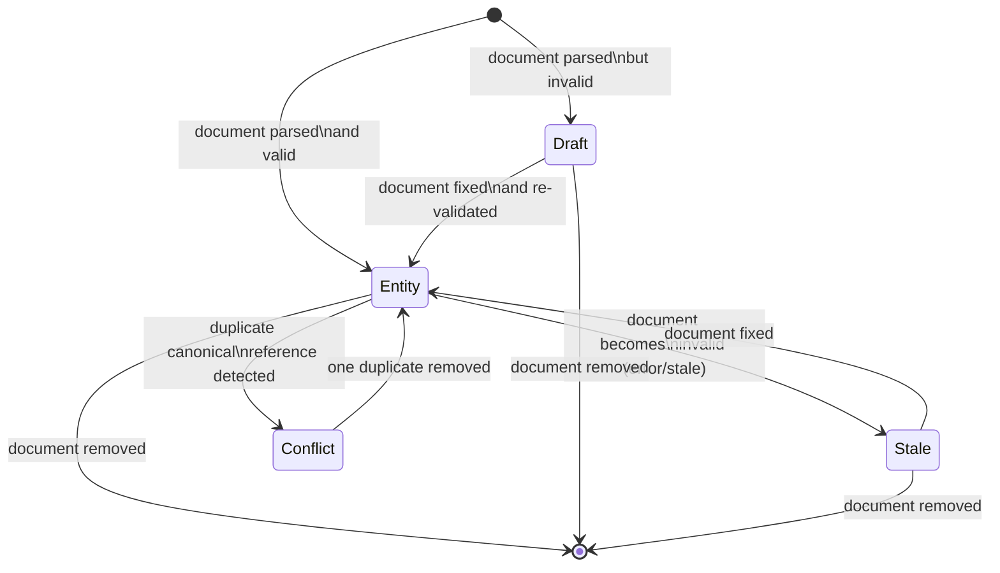

# :material-state-machine: State Management

The IDP Platform holds **all catalog state in-memory**. There is no persistent cache, no database, and no disk writes from the workspace (only from explicit source updates through the HTTP API).

---

## :material-diagram: Entity Lifecycle



---

## :material-information-outline: Entity States

### :material-check-circle: `entity` — Fully Resolved

A document that parsed, validated, and normalized successfully. It has:

- A canonical `EntityReference` (`kind:namespace/name`)
- A cached, normalized descriptor
- `health: healthy` (or `health: warning` for `Location` kind)
- `freshness: current`

### :material-pencil: `draft` — Never Valid

A document that has **never** successfully validated. It has:

- A `display_name` derived from the file path
- `health: error`
- No resolved entity reference (or a partially-resolved one if identity was parseable)

### :material-clock-alert: `stale` — Last-Valid

A document that was **previously valid** but is **currently invalid**. It:

- **Retains its last valid entity** in the workspace for the current process lifetime
- Shows `health: error, freshness: stale`
- The diagnostic points to the **current invalid content**, not the last valid state

!!! important "Process restart clears stale state"
    Stale last-valid entities live only for the duration of the process. After a restart, a document with no valid content on disk becomes a draft — there is no snapshot of the last-valid state.

### :material-alert: `conflict` — Duplicate Identity

When two or more documents claim the same canonical reference (`kind:namespace/name`), **neither** entity wins. Both are removed from the resolved entities map and replaced by a conflict node.

The conflict shows:
- Both source file paths
- `ENTITY_DUPLICATE_REF` diagnostic on each conflicting document
- Suggested action: `"Change metadata.namespace or the entity identifier"`

---

## :material-database: Internal Data Structures

`CatalogWorkspace` maintains five primary dictionaries:

```python
# Authoritative entities: reference → CatalogEntity
_entities: dict[str, CatalogEntity]

# Candidates awaiting authority resolution: reference → {uri → CatalogEntity}
_candidates_by_ref: dict[str, dict[str, CatalogEntity]]

# Source tracking: uri → canonical reference
_entity_ref_by_document: dict[str, str]

# Relations per document: uri → (CatalogRelation, ...)
_relations_by_document: dict[str, tuple[CatalogRelation, ...]]

# Draft entities (never-valid): uri → DraftEntity
_drafts: dict[str, DraftEntity]

# Per-document diagnostics: uri → (CatalogDiagnostic, ...)
_document_diagnostics: dict[str, tuple[CatalogDiagnostic, ...]]
```

Authority is resolved via `_refresh_authority(reference)`:

- **0 candidates** → remove from `_entities`
- **1 candidate** → promote to `_entities[reference]`
- **2+ candidates** → remove from `_entities` (conflict)

---

## :material-counter: Revision Counter

Every mutation to the workspace increments `_revision`. This integer is used for:

- SSE `CatalogChangeNotification` to signal state changes to clients
- Detecting superseded in-flight requests in the file watcher and language service

---

## :material-link: Further Reading

- [Architecture Overview](index.md)
- [Diagnostics Reference](../diagnostics/index.md)
- [Validation Engine](../backend/validation.md)
- [CatalogWorkspace Source](../backend/catalog-workspace.md)
