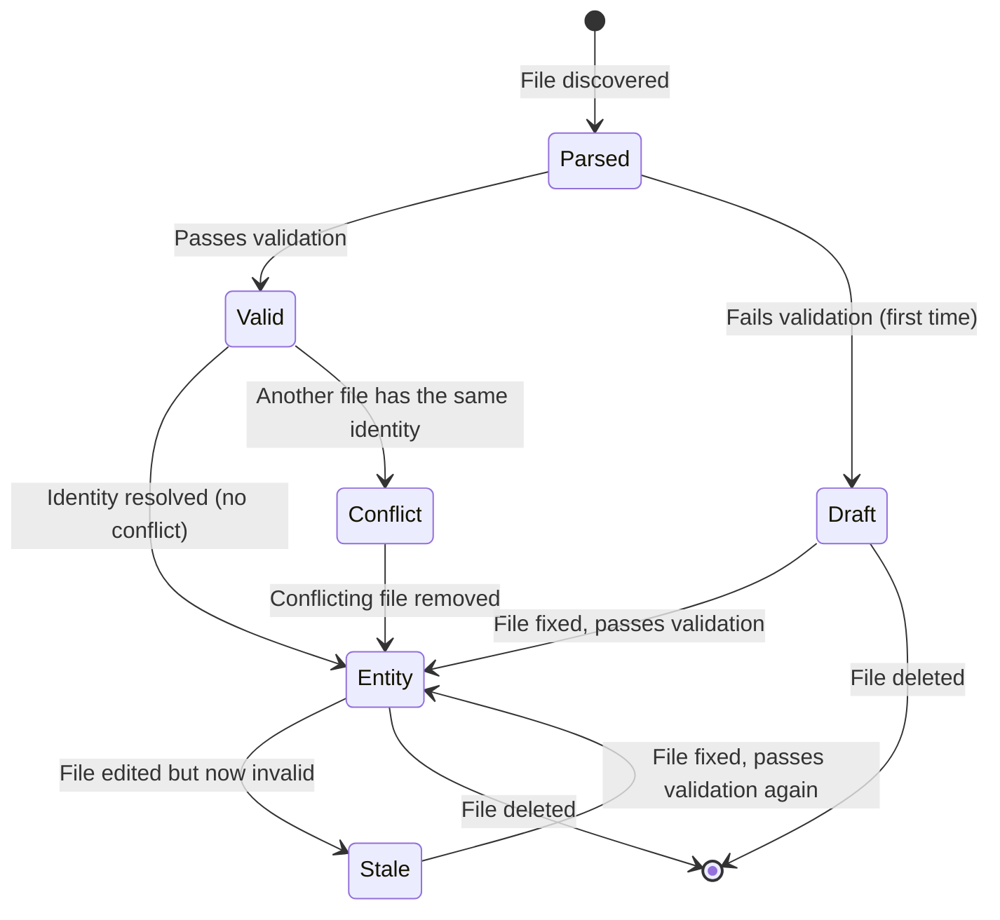
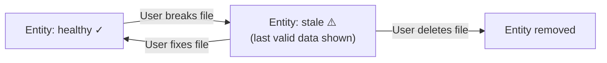

# :material-state-machine: State Management

The `CatalogWorkspace` maintains all catalog state in memory. This page explains the different states an entity can be in and how transitions happen.

---

## Entity Lifecycle

Every `catalog-info.yaml` file goes through a lifecycle as it is discovered, edited, and validated:



---

## Node States

Each entity in the topology graph has one of four states:

| State | Icon | Meaning |
|-------|------|---------|
| **Entity** | :material-check-circle:{ style="color: #4ade80" } | Fully valid and resolved. No problems. |
| **Draft** | :material-pencil-circle:{ style="color: #facc15" } | The file has errors and was never valid before. Shows up with limited info. |
| **Stale** | :material-clock-alert:{ style="color: #ef4444" } | The file was valid before but is now broken. The **last valid version** is kept visible. |
| **Conflict** | :material-alert-circle:{ style="color: #ef4444" } | Two or more files claim the same entity identity. None of them is shown. |
| **Unresolved** | :material-help-circle:{ style="color: #fbbf24" } | A relation target that does not exist in the catalog yet. |

---

## Internal Data Structures

The `CatalogWorkspace` uses these internal maps to track state:

### `_candidates_by_ref`

Maps each canonical entity reference to a dict of candidate documents:

```
"component:platform/payment-gateway" → {
    "file:///path/to/a/catalog-info.yaml": CatalogEntity(...),
    "file:///path/to/b/catalog-info.yaml": CatalogEntity(...)  ← conflict!
}
```

- **1 candidate** → entity is promoted to `_entities`
- **2+ candidates** → all are removed from `_entities`, conflict is detected
- **0 candidates** → entity is removed entirely

### `_entities`

The current resolved entity map. Only contains entities with exactly one candidate (no conflicts):

```
"component:platform/payment-gateway" → CatalogEntity(health=healthy, freshness=current)
```

### `_drafts`

Documents that failed validation and were never valid before:

```
"file:///path/to/broken/catalog-info.yaml" → DraftEntity(
    display_name="broken-service",
    entity_ref="component:platform/broken-service",  # may be null
    health=error
)
```

### `_document_diagnostics`

Active diagnostics for each document that has problems:

```
"file:///path/to/catalog-info.yaml" → (
    CatalogDiagnostic(code="SCHEMA_FIELD_REQUIRED", severity="error", ...),
    CatalogDiagnostic(code="REFERENCE_INVALID", severity="error", ...),
)
```

---

## Last-Valid State (Stale Entities)

When you edit a valid file and introduce an error, the system does **not** remove the entity immediately. Instead:

1. The entity is marked as **stale** (freshness = `stale`, health = `error`)
2. The last valid data stays visible in the topology graph
3. All relations from this entity are also marked as stale
4. The file's diagnostics show the current errors

This gives you time to fix your changes without the entity disappearing from the graph.

When you fix the error and save, the entity goes back to **healthy** and **current**.



---

## Conflict Detection

A conflict happens when two or more `catalog-info.yaml` files produce the same canonical entity reference.

**Example:** If both `services/a/catalog-info.yaml` and `services/b/catalog-info.yaml` define `component:platform/payment-gateway`, a conflict is created.

When a conflict exists:

- The entity is **removed** from the snapshot
- A **conflict node** appears in the topology graph
- Both documents get an `ENTITY_DUPLICATE_REF` error diagnostic
- The diagnostic tells you which other file is causing the conflict

To fix a conflict, change `metadata.namespace` or `spec.id` in one of the files so they produce different canonical references.

---

## Revision Counter

Every time the catalog state changes, the `_revision` counter increments by 1. This counter is used by:

- The **HTTP API** to tell clients when to refresh
- The **SSE stream** to notify browsers of changes
- The **LSP server** to notify VS Code of changes

The revision number is monotonically increasing and never resets during a session.

---

## Snapshot

At any point, you can get a **snapshot** of the entire catalog state by calling `workspace.snapshot()`. The snapshot contains:

| Field | Type | Description |
|-------|------|-------------|
| `revision` | `int` | Current revision number |
| `entities` | `dict[str, CatalogEntity]` | All resolved entities (keyed by canonical ref) |
| `relations` | `tuple[CatalogRelation, ...]` | All resolved relations with health status |
| `conflicts` | `dict[str, IdentityConflict]` | All identity conflicts |
| `drafts` | `dict[str, DraftEntity]` | All draft entities (failed first validation) |
| `diagnostics` | `tuple[CatalogDiagnostic, ...]` | All active diagnostics |

---

## Further Reading

- [CatalogWorkspace](../backend/catalog-workspace.md) — Implementation details
- [Diagnostic Codes](../diagnostics/codes.md) — All error and warning codes
- [Data Flow](data-flow.md) — How data moves through the pipeline
