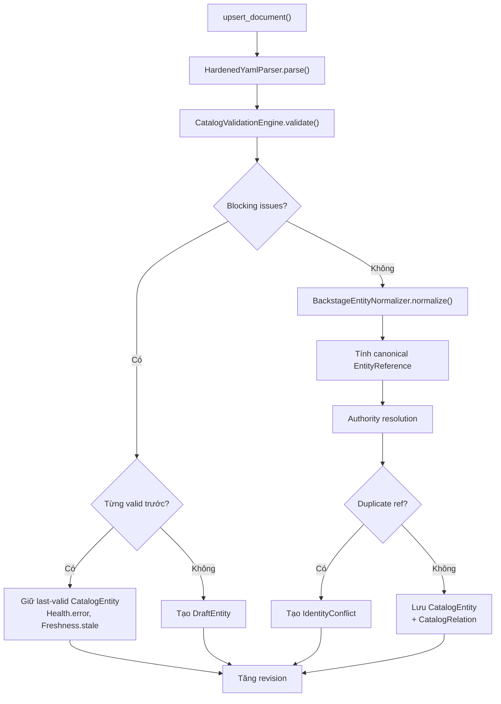

# :material-brain: `CatalogWorkspace`

`CatalogWorkspace` (`backend/app/catalog_workspace/workspace.py`) là **deep module** trung tâm. Toàn bộ catalog semantics — parsing, normalization, validation, relation projection, conflict detection, focused traversal, và diagnostics — đi qua class duy nhất này.

---

## :material-api: Public Interface

### Khởi tạo

```python
workspace = CatalogWorkspace.open(CatalogScope(roots=("file:///path/to/catalog",)))
```

### Vòng đời Document

```python
# Thêm hoặc cập nhật document
workspace.upsert_document(
    source_uri="file:///path/to/catalog-info.yaml",
    relative_path="my-service/catalog-info.yaml",
    content=b"specVersion: vsf-idp.io/v2\n...",
    version="optional-version-string",
)

# Xóa document
workspace.remove_document("file:///path/to/catalog-info.yaml")

# Nhận dữ liệu external (từ Supabase)
workspace.adopt_external(entities, relations)
```

### Đọc trạng thái

```python
# CatalogSnapshot đầy đủ
snapshot: CatalogSnapshot = workspace.snapshot()

# Tất cả CatalogDiagnostic hiện tại
diagnostics: tuple[CatalogDiagnostic, ...] = workspace.diagnostics()

# FocusedTopology one-hop
topology: FocusedTopology = workspace.focused_topology(
    "component:platform/payment-gateway",
    direction="both",  # "incoming" | "outgoing" | "both"
    depth=1,           # Cố định bằng 1
)

# FocusedTopology theo document URI (trước khi entity resolve)
topology = workspace.focused_topology_for_document(
    "file:///path/to/catalog-info.yaml",
    direction="both",
)
```

---

## :material-state-machine: Luồng xử lý Document

Khi `upsert_document()` được gọi:



---

## :material-graph: Thuật toán `FocusedTopology`

`focused_topology(root, direction, depth=1)`:

1. Xây dựng adjacency map outgoing và incoming từ tất cả `CatalogRelation` đã resolve
2. Bắt đầu với `frontier = {root_ref}`
3. Cho mỗi hop (depth=1):
    - Nếu `direction` bao gồm `outgoing`: theo tất cả outgoing edge từ frontier
    - Nếu `direction` bao gồm `incoming`: theo tất cả incoming edge từ frontier
    - Thêm node mới vào `included`
4. Thu thập tất cả `CatalogRelation` liên quan tới bất kỳ cặp node nào trong `included`
5. Tạo `TopologyNode` cho mỗi reference (`TopologyNodeState.ENTITY` / `DRAFT` / `CONFLICT` / `UNRESOLVED`)

---

## :material-alert: Xử lý `IdentityConflict`

Khi hai document claim cùng canonical `EntityReference`:

1. Cả hai được thêm vào `_candidates_by_ref[reference]`
2. `_refresh_authority()` phát hiện `len(candidates) > 1` → xóa khỏi `_entities`
3. `CatalogSnapshot.conflicts` chứa `IdentityConflict`
4. `CatalogDiagnostic` `ENTITY_DUPLICATE_REF` phát sinh cho mỗi document xung đột

---

## :material-data-matrix: Data Models chính

### `CatalogSnapshot`

```python
@dataclass(frozen=True, slots=True)
class CatalogSnapshot:
    revision: int
    entities: Mapping[str, CatalogEntity]
    relations: tuple[CatalogRelation, ...]
    conflicts: Mapping[str, IdentityConflict]
    drafts: Mapping[str, DraftEntity]
    diagnostics: tuple[CatalogDiagnostic, ...]
```

### `FocusedTopology`

```python
@dataclass(frozen=True, slots=True)
class FocusedTopology:
    root: str                    # Canonical EntityReference gốc
    direction: TopologyDirection  # "incoming" | "outgoing" | "both"
    depth: int | None            # Cố định bằng 1
    nodes: Mapping[str, TopologyNode]
    relations: tuple[CatalogRelation, ...]
```

### `CatalogEntity`

```python
@dataclass(frozen=True, slots=True)
class CatalogEntity:
    reference: EntityReference
    display_name: str
    descriptor: dict[str, Any]
    provenance: DocumentProvenance
    health: Health
    freshness: Freshness
    source: CatalogSource  # local | external
```

---

## :material-link: Đọc thêm

- [Ingest Pipeline](ingest-pipeline.md)
- [CatalogValidationEngine](validation.md)
- [Quản lý trạng thái](../architecture/state.md)
- [Data Schemas API](../api/schemas.md)
