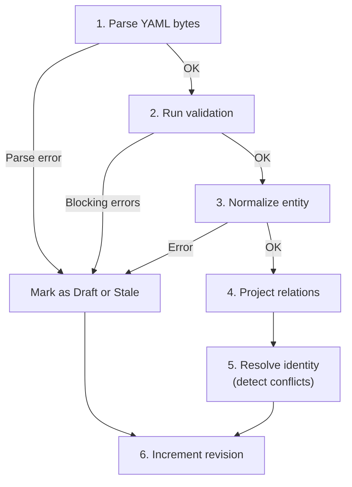

# :material-brain: CatalogWorkspace

`CatalogWorkspace` is the **central engine** of the IDP Platform. Every other component (HTTP API, Language Server, file watcher) talks to this single class to read or update catalog state.

**Location:** `backend/app/catalog_workspace/workspace.py`

---

## Public Interface

### Creating a Workspace

```python
from app.catalog_workspace.workspace import CatalogWorkspace
from app.catalog_workspace.models import CatalogScope

workspace = CatalogWorkspace.open(CatalogScope(roots=("file:///path/to/catalog",)))
```

### Adding or Updating a Document

```python
workspace.upsert_document(
    source_uri="file:///path/to/my-service/catalog-info.yaml",
    relative_path="my-service/catalog-info.yaml",
    content=b"specVersion: vsf-idp.io/v2\n...",
    version="optional-sha256-hash",
)
```

This call triggers the full pipeline: **parse → validate → normalize → project relations → resolve identity**.

### Removing a Document

```python
workspace.remove_document("file:///path/to/my-service/catalog-info.yaml")
```

### Reading the Current State

```python
# Get everything: entities, relations, conflicts, drafts, diagnostics
snapshot = workspace.snapshot()

# Get just the diagnostics
diagnostics = workspace.diagnostics()

# Get a one-hop view around an entity
topology = workspace.focused_topology(
    "component:platform/payment-gateway",
    direction="both",   # "incoming", "outgoing", or "both"
    depth=1,             # Always 1 (one hop)
)

# Get a topology view based on a file URI (before entity is resolved)
topology = workspace.focused_topology_for_document(
    "file:///path/to/catalog-info.yaml",
    direction="both",
)
```

---

## How `upsert_document()` Works

When you call `upsert_document()`, the workspace runs these steps in order:



If any step fails, the document is either:

- **Marked as draft** — if the document was never valid before
- **Marked as stale** — if the document was valid before (keeps the last valid entity)

---

## Focused Topology Algorithm

`focused_topology(root, direction, depth=1)` computes a one-hop view:

1. Build adjacency maps from all resolved relations (outgoing and incoming)
2. Start with `frontier = {root_ref}`
3. For one hop:
    - If `direction` is `"outgoing"` or `"both"`: follow all outgoing edges from the frontier
    - If `direction` is `"incoming"` or `"both"`: follow all incoming edges from the frontier
4. Collect all relations between the included nodes
5. Build a `TopologyNode` for each node (with state: entity, draft, conflict, or unresolved)

---

## Conflict Detection

When two documents claim the same canonical reference:

1. Both are added to the internal `_candidates_by_ref` map
2. The system detects `len(candidates) > 1` → removes the entity from the snapshot
3. A conflict record is created with references to both source files
4. Both documents get an `ENTITY_DUPLICATE_REF` blocking diagnostic

When one of the conflicting documents is removed or its identity changes, the remaining document becomes the sole authority and the entity is restored.

---

## Data Models

### CatalogSnapshot

```python
@dataclass(frozen=True, slots=True)
class CatalogSnapshot:
    revision: int
    entities: Mapping[str, CatalogEntity]
    relations: tuple[CatalogRelation, ...]
    conflicts: Mapping[str, IdentityConflict]
    drafts: Mapping[str, DraftEntity]
    diagnostics: tuple[CatalogDiagnostic, ...]
```

### FocusedTopology

```python
@dataclass(frozen=True, slots=True)
class FocusedTopology:
    root: str                     # Root entity reference
    direction: TopologyDirection  # "incoming" | "outgoing" | "both"
    depth: int | None             # Fixed at 1
    nodes: Mapping[str, TopologyNode]
    relations: tuple[CatalogRelation, ...]
```

### CatalogScope

```python
@dataclass(frozen=True, slots=True)
class CatalogScope:
    roots: tuple[str, ...]  # One or more catalog root URIs
```

---

## Further Reading

- [Ingest Pipeline](ingest-pipeline.md) — How parsing, normalization, and projection work
- [Validation Engine](validation.md) — How schema checks work
- [State Management](../architecture/state.md) — Entity lifecycle and conflict handling
- [API Schemas](../api/schemas.md) — Wire format of the snapshot and topology
