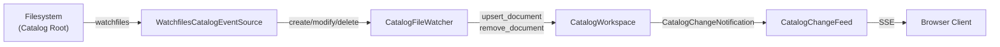

# :material-eye: `CatalogFileWatcher`

**File:** `backend/app/catalog_http/watcher.py`

`CatalogFileWatcher` kết nối filesystem changes với `CatalogWorkspace`, sử dụng thư viện `watchfiles` để phát hiện thay đổi trên Catalog Root.

---

## :material-cog: Kiến trúc

---

## :material-play: Vòng đời

1. **Startup**: Quét toàn bộ Catalog Root, tìm tất cả file `catalog-info.yaml`
2. **Initial load**: Gọi `CatalogWorkspace.upsert_document()` cho mỗi file
3. **Watch loop**: `WatchfilesCatalogEventSource` lắng nghe filesystem events
4. **On change**: Đọc nội dung file → `upsert_document()` hoặc `remove_document()`
5. **Notify**: `CatalogChangeFeed` phát SSE event với revision mới

---

## :material-filter: Bộ lọc file

| Quy tắc | Chi tiết |
|---|---|
| **Tên file** | Chỉ `catalog-info.yaml` |
| **Thư mục ẩn** | Bỏ qua thư mục bắt đầu bằng `.` |
| **Thư mục đặc biệt** | Bỏ qua `node_modules`, `__pycache__`, `.venv` |
| **Symlink** | Không follow symlink và junction |
| **Kích thước** | File > 1 MB → skip, phát sinh `CatalogDiagnostic` |

---

## :material-timer: Xử lý sự kiện

| Sự kiện | Hành động |
|---|---|
| File created | Đọc bytes → `CatalogWorkspace.upsert_document()` |
| File modified | Đọc bytes → `CatalogWorkspace.upsert_document()` |
| File deleted | `CatalogWorkspace.remove_document()` |

Tất cả events được xử lý **tuần tự** (serialized) để đảm bảo consistency với `CatalogWorkspace` (single-threaded).
