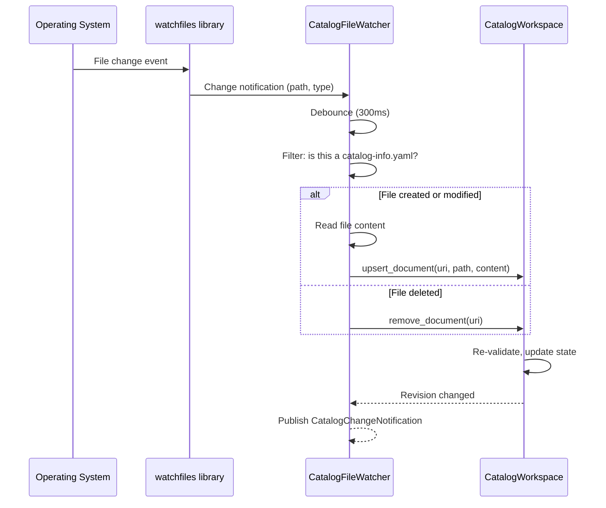

# :material-file-eye: File Watcher

The file watcher monitors the catalog root directory for changes. When a `catalog-info.yaml` file is created, modified, or deleted, the watcher updates the `CatalogWorkspace` automatically.

**Location:** `backend/app/local_catalog/watcher.py`

---

## How it Works



### Key Behaviors

| Behavior | Detail |
|----------|--------|
| **Library** | Uses [`watchfiles`](https://watchfiles.helpmanual.io/) (Rust-based, cross-platform) |
| **Debounce** | Waits **300 ms** after the last change before processing. This prevents processing partial saves. |
| **Filtering** | Only processes files named exactly `catalog-info.yaml` |
| **Skipped dirs** | Ignores `.git`, `.venv`, `node_modules`, `dist`, `build`, `__pycache__`, and dot-directories |
| **Symlinks** | Not followed (security) |
| **Large files** | Files over 1 MB are skipped |

---

## Change Notifications

After processing a change, the watcher publishes a `CatalogChangeNotification` containing:

```python
@dataclass
class CatalogChangeNotification:
    revision: int                    # New revision number
    changed_source_uris: list[str]   # Files that were added/modified
    removed_source_uris: list[str]   # Files that were deleted
```

This notification is consumed by:

- **SSE endpoint** → pushes to connected browsers
- **Language Server** → sends `catalog/revisionChanged` to VS Code

---

## Startup vs. Runtime

| Phase | What happens |
|-------|-------------|
| **Startup** | All files are discovered and loaded. No debounce — files are processed immediately. |
| **Runtime** | The watcher monitors for changes. Changes are debounced (300 ms) and processed individually. |

---

## Further Reading

- [Local HTTP Runtime](local-catalog.md) — The runtime that starts the watcher
- [Data Flow](../architecture/data-flow.md) — How data moves through the system
- [SSE Events](../api/events.md) — How changes are pushed to browsers
