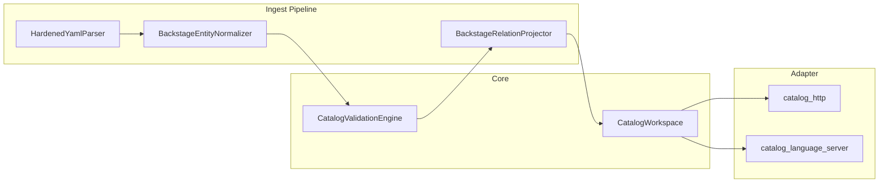

# :material-language-python: Backend

Backend là nơi chứa toàn bộ catalog semantics. Tất cả module được viết bằng Python.

-   :material-brain: **`CatalogWorkspace`**

    Deep module quản lý toàn bộ catalog state.

    [:octicons-arrow-right-24: Chi tiết](catalog-workspace.md)

-   :material-pipe: **Ingest Pipeline**

    `HardenedYamlParser` → `BackstageEntityNormalizer` → `BackstageRelationProjector`

    [:octicons-arrow-right-24: Chi tiết](ingest-pipeline.md)

-   :material-check-decagram: **`CatalogValidationEngine`**

    Schema + topology validation cho VSF IDP v2 và Backstage.

    [:octicons-arrow-right-24: Chi tiết](validation.md)

-   :material-server: **HTTP Runtime**

    `CatalogRuntime`, FastAPI, entity writes, `CatalogChangeFeed`.

    [:octicons-arrow-right-24: Chi tiết](local-catalog.md)

-   :material-eye: **`CatalogFileWatcher`**

    Theo dõi filesystem, phát sự kiện thay đổi.

    [:octicons-arrow-right-24: Chi tiết](file-watcher.md)

