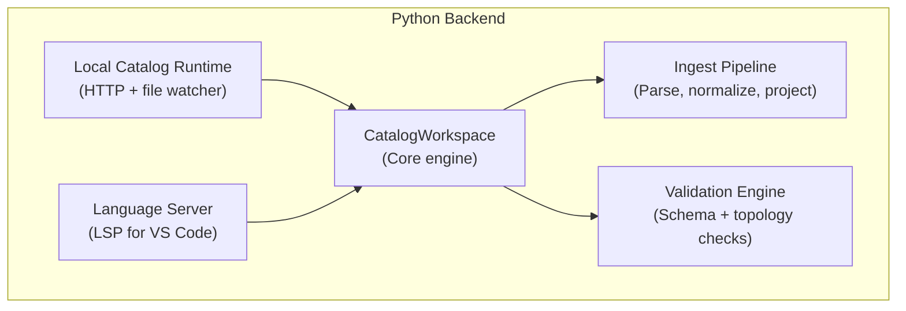

# :material-language-python: Backend

The backend is written in Python and contains all catalog logic. It has five main modules:

---

-   :material-brain:{ .lg .middle } **CatalogWorkspace**

    The core module. All catalog state lives here.

    [:octicons-arrow-right-24: CatalogWorkspace](catalog-workspace.md)

-   :material-pipe:{ .lg .middle } **Ingest Pipeline**

    YAML parsing, entity normalization, and relation projection.

    [:octicons-arrow-right-24: Ingest Pipeline](ingest-pipeline.md)

-   :material-shield-check:{ .lg .middle } **Validation Engine**

    Schema validation for both VSF IDP v2 and Backstage formats.

    [:octicons-arrow-right-24: Validation Engine](validation.md)

-   :material-server:{ .lg .middle } **Local Catalog Runtime**

    HTTP server (FastAPI) and filesystem discovery.

    [:octicons-arrow-right-24: Local HTTP Runtime](local-catalog.md)

-   :material-file-eye:{ .lg .middle } **File Watcher**

    Detects changes to catalog files and updates the workspace.

    [:octicons-arrow-right-24: File Watcher](file-watcher.md)

