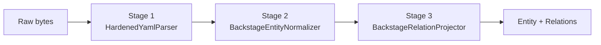

# :material-pipe: Ingest Pipeline

The ingest pipeline transforms raw `catalog-info.yaml` bytes into typed `Entity` objects and `Relation` tuples. It has three stages that run in order.

**Location:** `backend/app/ingest/`



---

## Stage 1: YAML Parsing — `HardenedYamlParser`

**File:** `backend/app/ingest/parser.py`

The parser uses a **strict YAML 1.2 JSON-compatible subset** to prevent security issues and surprising behavior.

### What it does

1. Decodes the bytes as UTF-8
2. Parses the YAML document tree using PyYAML with a custom `JsonScalarLoader`
3. Recursively converts the node tree to Python primitives (strings, numbers, booleans, lists, dicts)
4. Enforces all safety constraints (see below)

### Safety Constraints

The parser **rejects** YAML features that could cause security or correctness problems:

| Constraint | Error Code | Why |
|-----------|------------|-----|
| Must be valid UTF-8 | `YAML_INVALID_UTF8` | Prevents encoding attacks |
| Must be valid YAML syntax | `YAML_SYNTAX_ERROR` | Basic correctness |
| Must be exactly 1 document | `YAML_MULTIPLE_DOCUMENTS` | No `---` separators |
| Root must be a mapping (dict) | `YAML_ROOT_NOT_MAPPING` | Cannot be a list or scalar |
| No YAML aliases/anchors (`*x`, `&x`) | `YAML_ALIAS_UNSUPPORTED` | Prevents billion-laughs DoS |
| All keys must be strings | `YAML_NON_STRING_KEY` | JSON compatibility |
| No duplicate mapping keys | `YAML_DUPLICATE_KEY` | Prevents silent data loss |
| No custom YAML tags (`!!tag`) | `YAML_TAG_UNSUPPORTED` | Prevents arbitrary types |
| No bare timestamps | `YAML_TIMESTAMP_UNSUPPORTED` | Would silently convert strings to dates |
| No NaN or Infinity values | `YAML_NON_FINITE_NUMBER` | Not valid JSON |

### Usage

```python
from app.ingest.parser import HardenedYamlParser, DescriptorParseError

parser = HardenedYamlParser()

try:
    descriptor = parser.parse(b"specVersion: vsf-idp.io/v2\n...")
except DescriptorParseError as e:
    print(e.code)       # e.g., "YAML_SYNTAX_ERROR"
    print(e.message)    # Human-readable description
    print(e.line)       # Line number (if available)
    print(e.column)     # Column number (if available)
```

---

## Stage 2: Normalization — `BackstageEntityNormalizer`

**File:** `backend/app/ingest/normalizer.py`

The normalizer converts a raw Python dict into a typed `Entity` Pydantic model with a canonical `entity_ref`.

### Format Detection

The normalizer automatically detects the format:

- If `"specVersion"` is in the dict → **VSF IDP v2** normalization
- Otherwise → **Backstage** normalization

### VSF IDP v2 Normalization

1. Validates that `specVersion == "vsf-idp.io/v2"`
2. Computes the reference: `component:{metadata.namespace}/{spec.id}`
3. Creates synthetic Backstage-compatible fields (`metadata.name`, `apiVersion`, `kind`)
4. Returns a typed `Entity` object

### Backstage Normalization

1. Reads `apiVersion`, `kind`, `metadata.name`, `metadata.namespace`
2. Computes the reference: `{kind}:{namespace}/{name}` (all lowercased)
3. Normalizes all reference fields in `spec` to canonical form (see table below)
4. Returns a typed `Entity` object

### Reference Field Normalization

These `spec` fields are automatically normalized to canonical references:

| Field | Default Kind | Multiple? |
|-------|-------------|-----------|
| `spec.owner` | `group` | No |
| `spec.system` | `system` | No |
| `spec.domain` | `domain` | No |
| `spec.parent` | `group` | No |
| `spec.dependsOn[]` | `component` | Yes |
| `spec.providesApis[]` | `api` | Yes |
| `spec.consumesApis[]` | `api` | Yes |
| `spec.publishesTo[]` | `event` | Yes |
| `spec.consumesFrom[]` | `event` | Yes |

---

## Stage 3: Relation Projection — `BackstageRelationProjector`

**File:** `backend/app/ingest/relation_projector.py`

The projector reads the normalized `spec` fields and creates typed `Relation` value objects.

### Output

```python
@dataclass(frozen=True, slots=True)
class ProjectionResult:
    relations: tuple[Relation, ...]
    issues: tuple[ValidationIssue, ...]
```

### What it checks

| Check | Action |
|-------|--------|
| Duplicate `(source, relation_type, target)` | Deduplicated — only the first one is kept |
| Entity references itself | `TOPOLOGY_SELF_REFERENCE` error (blocking) |
| Target entity not in catalog | `REFERENCE_TARGET_NOT_FOUND` warning (non-blocking) |

---

## Further Reading

- [CatalogWorkspace](catalog-workspace.md) — How the workspace uses the pipeline
- [Validation Engine](validation.md) — Schema validation details
- [Diagnostic Codes](../diagnostics/codes.md) — All error and warning codes
