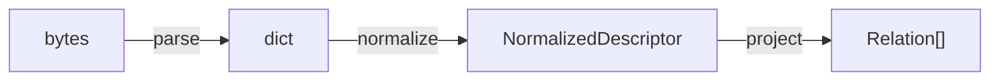

# :material-pipe: Ingest Pipeline

Ingest pipeline biến bytes từ file `catalog-info.yaml` thành `NormalizedDescriptor` và `Relation` objects. Pipeline gồm 3 giai đoạn tuần tự:

---

## :material-code-braces: `HardenedYamlParser`

**File:** `backend/app/ingest/parser.py`

Chuyển đổi YAML bytes sang Python dict, áp dụng **YAML 1.2 JSON-compatible subset**. Tất cả lỗi parse được gói trong `DescriptorParseError` với mã lỗi ổn định (stable error code).

### Quy tắc reject

| Quy tắc | Mã lỗi | Lý do |
|---|---|---|
| Không phải UTF-8 | `YAML_INVALID_UTF8` | Bảo vệ xử lý chuỗi |
| Syntax error | `YAML_SYNTAX_ERROR` | YAML không hợp lệ |
| Nhiều document | `YAML_MULTIPLE_DOCUMENTS` | Một file = một descriptor |
| Root không phải mapping | `YAML_ROOT_NOT_MAPPING` | Descriptor phải là object |
| YAML alias (`*anchor`) | `YAML_ALIAS_UNSUPPORTED` | Ngăn circular reference |
| Mapping key không phải string | `YAML_NON_STRING_KEY` | JSON-compatible subset |
| Duplicate mapping key | `YAML_DUPLICATE_KEY` | Tránh mất dữ liệu |
| YAML tag (`!!type`) | `YAML_TAG_UNSUPPORTED` | Hạn chế tính năng YAML |
| Timestamp bare value | `YAML_TIMESTAMP_UNSUPPORTED` | Phải dùng quoted string |
| NaN / Infinity | `YAML_NON_FINITE_NUMBER` | JSON không hỗ trợ |

---

## :material-swap-horizontal: `BackstageEntityNormalizer`

**File:** `backend/app/ingest/normalizer.py`

Chuyển đổi `dict` thành `NormalizedDescriptor` (Pydantic model). Xử lý cả hai format:

### Xử lý VSF IDP v2

1. Đọc `metadata.domain`, `metadata.system`, `metadata.namespace`
2. Chuyển đổi `spec.id` → `metadata.name`, `spec.name` → `metadata.title`
3. Set `apiVersion` = `"vsf-idp.io/v2"`, `kind` = `"Component"`
4. Tính canonical `EntityReference`: `component:{namespace}/{id}`

### Xử lý Backstage

1. Đọc `apiVersion`, `kind`, `metadata.name`, `metadata.namespace` (mặc định `"default"`)
2. Tính canonical `EntityReference`: `{kind}:{namespace}/{name}` (lowercase)

### Lỗi normalization

| Lỗi | `DescriptorNormalizationError` |
|---|---|
| Thiếu `apiVersion` hoặc `kind` | Cho Backstage descriptor |
| Thiếu `metadata.namespace` hoặc `spec.id` | Cho VSF v2 descriptor |
| Segment không hợp lệ (regex `^[a-z0-9][a-z0-9._-]{0,62}$`) | Cho cả hai |

---

## :material-relation-many-to-many: `BackstageRelationProjector`

**File:** `backend/app/ingest/relation_projector.py`

Chiếu declared fields trong `spec` thành typed `Relation` objects.

### Spec fields → `RelationType`

| Spec Field | `RelationType` | Default Kind | Multiple? |
|---|---|---|---|
| `spec.system` | `partOf` | `system` | Không |
| `spec.domain` | `partOf` | `domain` | Không |
| `spec.parent` | `partOf` | `group` | Không |
| `spec.dependsOn[]` | `dependsOn` | `component` | Có |
| `spec.providesApis[]` | `providesApi` | `api` | Có |
| `spec.consumesApis[]` | `consumesApi` | `api` | Có |
| `spec.publishesTo[]` | `publishesTo` | `event` | Có |
| `spec.consumesFrom[]` | `consumesFrom` | `event` | Có |

### Topology fields (VSF v2 `spec.topology[]`)

Cho VSF v2, `spec.topology[].ref` sử dụng format `type:ref`:

| Type Prefix | `RelationType` | Default Kind |
|---|---|---|
| `system` | `partOf` | `system` |
| `component` | `dependsOn` | `component` |
| `resource` | `dependsOn` | `resource` |
| `providesApis` | `providesApi` | `api` |
| `consumesApis` | `consumesApi` | `api` |
| `publishesTo` | `publishesTo` | `event` |
| `consumesFrom` | `consumesFrom` | `event` |
| `module` | `contains` | `module` |
| `function` | `contains` | `function` |

### Validation trong projection

- `REFERENCE_INVALID`: Reference string không parse được
- `TOPOLOGY_SELF_REFERENCE`: Entity tự reference chính nó
- `REFERENCE_TARGET_NOT_FOUND`: Target không tồn tại trong `CatalogSnapshot` (warning, non-blocking)

---

## :material-link: Đọc thêm

- [`CatalogWorkspace`](catalog-workspace.md)
- [`CatalogValidationEngine`](validation.md)
- [Luồng dữ liệu](../architecture/data-flow.md)
