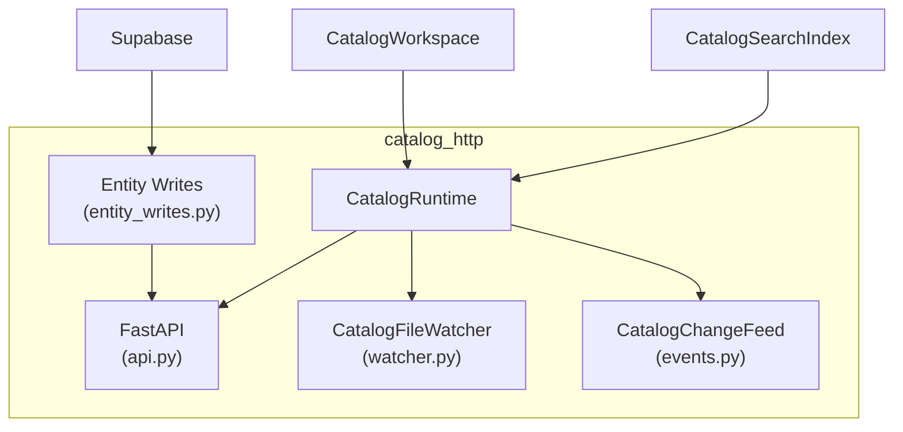

# :material-server: HTTP Runtime (`catalog_http`)

**Module:** `backend/app/catalog_http/`

`catalog_http` là HTTP adapter wrap `CatalogWorkspace` với FastAPI, cung cấp REST API cho browser `TopologyViewer`. Module gồm các thành phần:



---

## :material-play-circle: `CatalogRuntime`

**File:** `catalog_http/runtime.py`

Lớp orchestrator khởi tạo và kết nối các thành phần:

1. Tạo `CatalogWorkspace` với `CatalogScope` từ `CATALOG_ROOT`
2. Khởi động `CatalogFileWatcher` — quét và theo dõi file
3. Xây dựng `CatalogSearchIndex` từ `CatalogSnapshot` ban đầu
4. Đăng ký `CatalogChangeFeed` — SSE pub/sub
5. Bind FastAPI lên `127.0.0.1:PORT`

### Sync External

```python
async def sync_external(runtime: CatalogRuntime):
    entities, relations = fetch_external_catalog()  # Đọc từ Supabase
    runtime.workspace.adopt_external(entities, relations)
    runtime.search_index.rebuild(runtime.workspace.snapshot())
```

---

## :material-pencil: Entity Writes (`entity_writes.py`)

Luồng ghi entity external qua Supabase — **không** áp dụng cho local files.

### Các operation

| Function | Mô tả | HTTP Endpoint |
|---|---|---|
| `create_entity(text)` | Parse YAML → validate → insert row Supabase | `POST /api/v1/catalog/entities` |
| `replace_entity(ref, text, version)` | Re-validate → update row | `PUT /api/v1/catalog/entities/{ref}` |
| `delete_entity(ref, version)` | Xóa row, giữ lại relation trỏ tới | `DELETE /api/v1/catalog/entities/{ref}` |
| `set_entity_field(ref, path, value, version)` | Sửa 1 scalar field | `PATCH /api/v1/catalog/entities/{ref}/field` |
| `append_entity_owner(ref, user, role, version)` | Thêm owner member | `POST /api/v1/catalog/entities/{ref}/owners` |
| `remove_entity_owner(ref, index, version)` | Xóa owner member | `DELETE /api/v1/catalog/entities/{ref}/owners/{index}` |

### Validation flow

Tất cả writes đều qua `validate_descriptor_text()`:

1. `HardenedYamlParser.parse()` — parse YAML text
2. `CatalogValidationEngine.validate()` — schema + topology
3. Nếu có blocking `ValidationIssue` → raise `EntityInvalid` (HTTP `422`)
4. Nếu ok → ghi vào Supabase

### Optimistic concurrency

- `expected_version` = giá trị `updated_at` từ Supabase row
- Nếu row đã thay đổi → `EntityVersionConflict` (HTTP `409`)

### Lỗi

| Exception | HTTP Code | Mô tả |
|---|---|---|
| `EntityInvalid` | `422` | Validation failed |
| `EntityNotFound` | `404` | Reference không tồn tại |
| `EntityAlreadyExists` | `409` | POST nhưng reference đã có |
| `EntityVersionConflict` | `409` | PUT/DELETE nhưng version mismatch |

---

## :material-broadcast: `CatalogChangeFeed`

**File:** `catalog_http/events.py`

SSE pub/sub feed thông báo revision thay đổi tới browser client.

- Endpoint: `GET /api/v1/catalog/events` → `text/event-stream`
- Payload: `CatalogChangeNotification` chứa `revision`, `changed_source_uris`, `removed_source_uris`
- Client nhận event → refetch `CatalogSnapshot` hoặc `FocusedTopology`

---

## :material-link: Đọc thêm

- [Tham chiếu Endpoints](../api/endpoints.md)
- [`CatalogFileWatcher`](file-watcher.md)
- [`CatalogWorkspace`](catalog-workspace.md)
