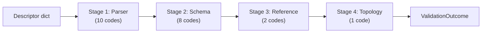

# :material-shield-check: Validation Engine

The `CatalogValidationEngine` validates every `catalog-info.yaml` descriptor. It checks both VSF IDP v2 and Backstage formats using a four-stage pipeline with 22 diagnostic codes.

**Location:** `backend/app/validators/engine.py`

---

## Validation Pipeline



Each stage can produce issues. If any **blocking** issue is found, the entity is not registered in the catalog.

### Stage Summary

| Stage | What it checks | # Codes | All blocking? |
|-------|---------------|---------|---------------|
| **Parser** | YAML syntax and safety | 10 | ✅ Yes |
| **Schema** | Required fields, field formats, types | 8 | ✅ Yes |
| **Reference** | Entity reference syntax and targets | 2 | Mixed |
| **Topology** | Self-references | 1 | ✅ Yes |

---

## Format-Specific Validation

The engine detects the format automatically and applies different schema rules:

### VSF IDP v2 Schema Checks

When `specVersion` is present in the descriptor:

| Check | Error Code |
|-------|-----------|
| `specVersion` must be `"vsf-idp.io/v2"` | `SCHEMA_SPEC_VERSION_INVALID` |
| `metadata` must be an object | `SCHEMA_METADATA_REQUIRED` |
| `spec` must be an object | `SCHEMA_SPEC_INVALID` |
| `metadata.domain` must be non-blank, ≤128 chars | `SCHEMA_FIELD_REQUIRED` / `SCHEMA_FIELD_INVALID` |
| `metadata.system` must match `^[a-z][a-z0-9-]*$` | `SCHEMA_FIELD_INVALID` |
| `metadata.namespace` must match `^[a-z][a-z0-9-]*$` | `SCHEMA_FIELD_INVALID` |
| `spec.type` must be a supported component type | `SCHEMA_FIELD_INVALID` |
| `spec.id` must match `^[a-z][a-z0-9-]*$` | `SCHEMA_FIELD_INVALID` |
| `spec.name` must not contain control characters | `SCHEMA_FIELD_INVALID` |
| `spec.owners.members` must have ≥1 member | `SCHEMA_FIELD_REQUIRED` |
| Each member `user` must be a `@vinsmartfuture.tech` email | `SCHEMA_FIELD_INVALID` |
| Each member `role` must be `techlead`, `maintainer`, or `member` | `SCHEMA_FIELD_INVALID` |
| At least one member must have `role: techlead` | `SCHEMA_FIELD_REQUIRED` |
| `spec.review.branch` required for `service`/`gateway` | `SCHEMA_FIELD_REQUIRED` |
| Each topology item must have `ref` | `SCHEMA_FIELD_INVALID` |

### Backstage Schema Checks

When no `specVersion` is present:

| Check | Error Code |
|-------|-----------|
| `apiVersion` must be a non-empty string | `SCHEMA_API_VERSION_REQUIRED` |
| `kind` must be a non-empty string | `SCHEMA_KIND_REQUIRED` |
| `metadata` must be an object | `SCHEMA_METADATA_REQUIRED` |
| `metadata.name` must be a non-empty string | `SCHEMA_METADATA_NAME_REQUIRED` |
| `spec` (if present) must be an object | `SCHEMA_SPEC_INVALID` |

---

## How Validation Works

The engine returns a `ValidationOutcome` object:

```python
@dataclass(frozen=True, slots=True)
class ValidationOutcome:
    entity: Entity | None          # None if blocking errors
    relations: tuple[Relation, ...]
    report: ValidationReport
```

- If **blocking errors** exist → `entity` is `None`, the document becomes a draft or stale
- If **only warnings** exist → `entity` is returned, warnings appear as diagnostics

---

## Issue Registry

All 22 diagnostic codes are defined in `backend/app/validators/registry.py`. Each code has:

| Property | Description |
|----------|-------------|
| `code` | Unique string identifier (e.g., `YAML_SYNTAX_ERROR`) |
| `stage` | Which validation stage produces it |
| `default_severity` | `error` or `warning` |
| `blocking` | Whether this prevents entity registration |
| `order` | Sort order for consistent output |

See the full list at [Diagnostic Codes](../diagnostics/codes.md).

---

## Further Reading

- [Diagnostic Codes](../diagnostics/codes.md) — Complete code reference
- [Severity Guide](../diagnostics/severity.md) — What error vs. warning means
- [Ingest Pipeline](ingest-pipeline.md) — Parsing and normalization
- [CatalogWorkspace](catalog-workspace.md) — How the workspace uses validation
