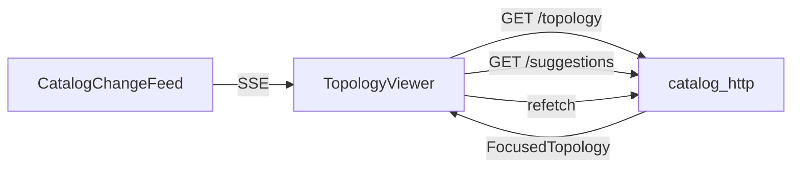

# :material-graph: `TopologyViewer`

**File:** `frontend/src/topology/TopologyViewer.tsx`

`TopologyViewer` là component React chính, sử dụng ReactFlow để render focused topology graph tương tác.

---

## :material-cog: Chức năng

| Chức năng | Mô tả |
|---|---|
| **Render graph** | Hiển thị `TopologyNode` và `CatalogRelation` từ `FocusedTopology` |
| **Navigation** | Click node → đặt node đó làm root mới → refetch `FocusedTopology` |
| **Search** | Focus-search dropdown gọi `/api/v1/catalog/suggestions` |
| **Detail panel** | Hiển thị `CatalogEntity` details, owners, relations khi click node |
| **Real-time** | SSE subscription qua `CatalogChangeFeed` → auto refetch |
| **Visual states** | Màu sắc theo `Health`, `Freshness`, `TopologyNodeState` |

---

## :material-transit-connection-variant: Luồng dữ liệu

---

## :material-pencil: Inline Editing

`TopologyViewer` hỗ trợ inline editing cho external entities:

| Component | File | Chức năng |
|---|---|---|
| `EditableDetailField` | `EditableDetailField.tsx` | Sửa scalar field (`PATCH /field`) |
| `OwnerDetailSection` | `OwnerDetailSection.tsx` | Quản lý owners (`POST`/`DELETE /owners`) |
| `RelationDetailSection` | `RelationDetailSection.tsx` | Quản lý relations |
| `AddOwnerDetailField` | `AddOwnerDetailField.tsx` | Form thêm owner mới |

---

## :material-link: Đọc thêm

- [Tìm kiếm Catalog](catalog-search.md)
- [Trạng thái hiển thị](visual-states.md)
- [`FocusedTopology` API](../api/endpoints.md#topology)
