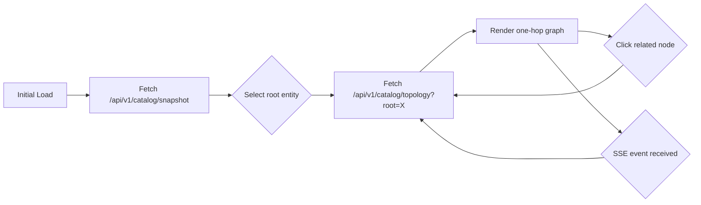

# :material-graph: Topology Viewer

**File:** `frontend/src/topology/TopologyViewer.tsx`

The topology viewer is the main React component that renders the interactive service graph using ReactFlow.

---

## :material-monitor: Features

| Feature | Description |
|---------|-------------|
| :material-graph: **One-hop graph** | Renders the root entity and its immediate neighbors |
| :material-cursor-default-click: **Click to navigate** | Click any related node to make it the new focused root |
| :material-pin: **Pin focus** | Lock the current root to prevent active-editor auto-navigation |
| :material-badge-outline: **Health badges** | Visual badges for healthy, warning, error, stale, draft, and conflict states |
| :material-refresh: **Auto-refresh** | SSE events trigger automatic re-fetch and re-render |
| :material-magnify: **Catalog search** | Full-text search across the entire catalog snapshot |
| :material-information-outline: **Inspector panel** | Shows diagnostics and relation provenance for the focused node |

---

## :material-link-variant: Navigation Model



The viewer is **intentionally fixed to one hop**. Navigation continues by clicking related nodes, each becoming the new root for the next focused view.

---

## :material-api: API Contract — `localContract.ts`

The frontend maps HTTP API responses to strongly-typed TypeScript interfaces:

```typescript
// types.ts
interface TopologyNode {
  reference: string;
  displayName: string;
  state: "entity" | "unresolved" | "conflict" | "draft";
  health: "healthy" | "warning" | "error";
  freshness: "current" | "stale";
  // ...
}

interface CatalogRelation {
  source: string;
  target: string;
  relationType: RelationType;
  health: Health;
  freshness: Freshness;
  provisional: boolean;
  protocol?: string;
  reason?: string;
}
```

---

## :material-link: Further Reading

- [Visual States](visual-states.md)
- [Catalog Search](catalog-search.md)
- [API Topology Endpoint](../api/endpoints.md#get-apiv1catalogtopology)
- [ReactFlow Documentation](https://reactflow.dev/)
