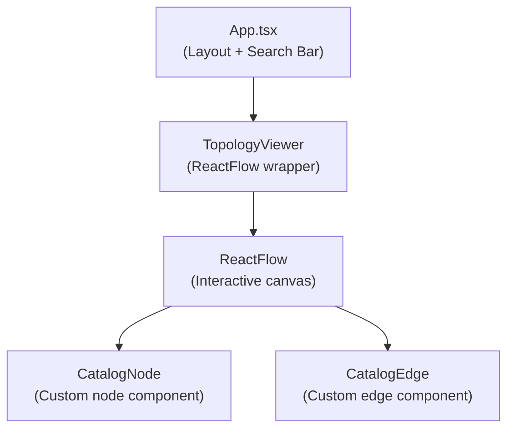

# :material-graph: Topology Viewer

The `TopologyViewer` is the main component of the frontend. It uses the **ReactFlow** library to render entities as nodes and relations as edges.

**Location:** `frontend/src/topology/TopologyViewer.tsx`

---

## Component Structure

---

## Layout Algorithm

The graph uses a **force-directed layout** (implemented in `frontend/src/topology/topologyLayout.local.test.ts` for testing, but ReactFlow provides the visual layout).

Nodes are arranged concentrically:
- The **focused root node** is always in the center.
- Nodes connected by `dependsOn` or `consumesApi` are placed on the left (inputs).
- Nodes connected by `providesApi` or `publishesTo` are placed on the right (outputs).
- Nodes connected by `partOf` are placed above or below.

---

## Interaction

- **Click a node:** Changes the `root` parameter and re-fetches the topology focused on that new node.
- **Hover an edge:** Highlights the connection and shows the `protocol` and `reason` (if provided).
- **Pan and Zoom:** Built-in ReactFlow controls for navigating large graphs.

---

## Real-time Updates

The `TopologyViewer` listens to the `onRevisionChanged` callback from the API client (which is driven by the SSE event stream).

When an event fires:
1. The viewer calls `client.getFocusedTopology(currentRoot)` again.
2. The new data replaces the old data.
3. ReactFlow automatically animates the nodes to their new positions.

---

## Further Reading

- [Visual States](visual-states.md) — How nodes are styled based on health/freshness
- [Catalog Search](catalog-search.md) — The search bar implementation
- [ReactFlow Documentation](https://reactflow.dev/)
