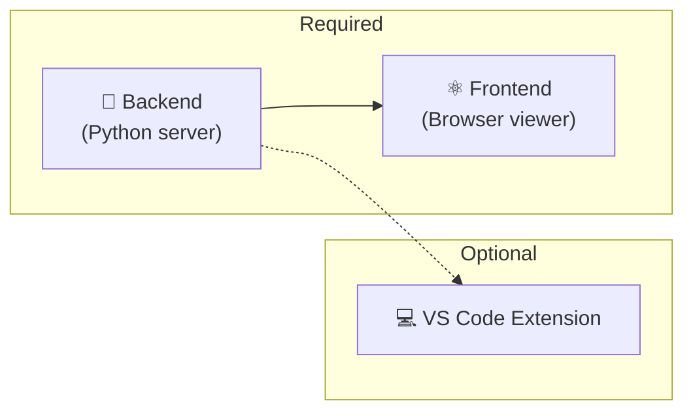

# :material-play-circle-outline: Getting Started

Welcome! This section helps you install and run the IDP Platform on your machine.

The IDP Platform has **three components** you can set up:

| Component | What it does | Required? |
|-----------|-------------|-----------|
| **Backend** | Reads catalog files, validates them, serves API | ✅ Yes |
| **Frontend** | Shows the topology graph in your browser | ✅ Yes |
| **VS Code Extension** | Shows diagnostics and topology inside your editor | Optional |

---

## Where to Start

-   :material-clipboard-check-outline:{ .lg .middle } **1. Check Prerequisites**

    Make sure Python 3.12+ and Node.js 20+ are installed.

    [:octicons-arrow-right-24: Prerequisites](prerequisites.md)

-   :material-download-circle-outline:{ .lg .middle } **2. Install**

    Clone the repo and install all dependencies step by step.

    [:octicons-arrow-right-24: Installation](installation.md)

-   :material-rocket-launch-outline:{ .lg .middle } **3. Quick Start**

    Start the backend and frontend, then open the topology viewer.

    [:octicons-arrow-right-24: Quick Start](quickstart.md)

-   :material-cog-outline:{ .lg .middle } **4. Configure**

    Change the catalog root, API port, and other settings.

    [:octicons-arrow-right-24: Configuration](configuration.md)

