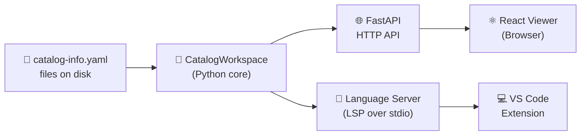

# :material-graph-outline: IDP Platform — Local Catalog Topology

<div class="grid cards" markdown>

-   :material-rocket-launch-outline:{ .lg .middle } **Get Started**

    ---

    Set up the platform in minutes. No database, no containers, no cloud services needed.

    [:octicons-arrow-right-24: Getting Started](getting-started/index.md)

-   :material-sitemap:{ .lg .middle } **Architecture**

    ---

    Learn how the system works: `CatalogWorkspace` at the core, with FastAPI, LSP, React, and VS Code as adapters.

    [:octicons-arrow-right-24: Architecture](architecture/index.md)

-   :material-file-code-outline:{ .lg .middle } **Descriptor Format**

    ---

    Write `catalog-info.yaml` files using VSF IDP v2 or Backstage format.

    [:octicons-arrow-right-24: Descriptor Guide](descriptor/index.md)

-   :material-api:{ .lg .middle } **HTTP API**

    ---

    Local REST API for catalog snapshots, topology views, diagnostics, and live SSE events.

    [:octicons-arrow-right-24: API Reference](api/index.md)

-   :material-microsoft-visual-studio-code:{ .lg .middle } **VS Code Extension**

    ---

    See validation errors and topology graphs directly in your editor, with live updates as you type.

    [:octicons-arrow-right-24: Extension Guide](vscode/index.md)

-   :material-gauge:{ .lg .middle } **Performance**

    ---

    Benchmarks show 1,000 entities load in ~511 ms and focused views respond in under 5 ms.

    [:octicons-arrow-right-24: Performance](performance/index.md)

</div>

---

## What is IDP Platform?

**IDP Platform** is a **local-first developer tool** for browsing the declared service topology in your workspace. It reads `catalog-info.yaml` files from your local disk, validates them, and shows the service graph — in a browser or inside VS Code.

**No database, no remote server, no login required.** Everything runs on your machine.



!!! info "Design Philosophy"
    **Python owns all catalog logic.** The HTTP layer and LSP server are thin adapters. TypeScript and React only handle display. This means the same validation engine runs everywhere — filesystem scanning, HTTP requests, and editor diagnostics all produce the same results.

---

## Key Features

| Feature | Description |
|---|---|
| :material-file-search: **File Discovery** | Automatically finds all `catalog-info.yaml` files in your project folders |
| :material-check-all: **Two Schema Formats** | Supports both VSF IDP v2 (`specVersion: vsf-idp.io/v2`) and Backstage descriptors |
| :material-graph: **Topology Graph** | Shows a one-hop view of service connections — click any node to explore further |
| :material-stethoscope: **Live Diagnostics** | Shows errors and warnings with exact file location and suggested fixes |
| :material-history: **Last-Valid State** | When you break a file while editing, the previous valid version stays visible |
| :material-alert: **Conflict Detection** | Catches when two files try to define the same service identity |
| :material-eye: **Real-Time Updates** | Saving a file automatically updates the browser view and editor diagnostics |
| :material-microsoft-visual-studio-code: **Editor Integration** | See validation errors and topology webview directly in VS Code |
| :material-speedometer: **Fast** | 1,000 entities load in ~511 ms; focused topology responds in under 5 ms |

---

## Project Map

```
idp-platform/
├── backend/            # Python — API server, catalog engine, LSP, file watcher
│   └── app/
│       ├── catalog_workspace/   # Core: CatalogWorkspace (all catalog logic)
│       ├── ingest/              # YAML parsing, normalization, relation projection
│       ├── validators/          # Schema + reference + topology validation
│       ├── domain/              # Entity, EntityReference, RelationType
│       ├── local_catalog/       # HTTP server, file watcher, filesystem adapter
│       └── catalog_language_server/  # LSP server for VS Code
├── frontend/           # React + ReactFlow — browser topology viewer
├── vscode-extension/   # VS Code extension — LSP client + topology webview
├── cli/                # CLI tool (planned, not yet ready)
├── openapi/            # OpenAPI 3.1 specification
├── contracts/          # Contract-tested JSON examples
└── site/docs/          # This documentation (MkDocs Material)
```

---

## References

- [Backstage Software Catalog](https://backstage.io/docs/features/software-catalog/)
- [OpenAPI Specification 3.1](https://spec.openapis.org/oas/v3.1.0)
- [Language Server Protocol](https://microsoft.github.io/language-server-protocol/)
- [MkDocs Material Documentation](https://squidfunk.github.io/mkdocs-material/)
- [FastAPI Documentation](https://fastapi.tiangolo.com/)
- [ReactFlow Documentation](https://reactflow.dev/)
