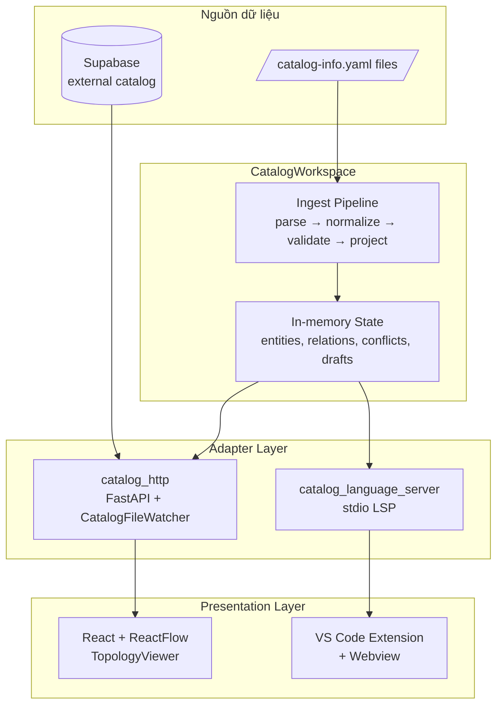

# :material-graph-outline: IDP Platform — Local Catalog Topology

<div class="grid cards" markdown>

-   :material-rocket-launch-outline:{ .lg .middle } **Bắt đầu**

    ---

    Khởi chạy hệ thống từ đầu trong vài phút. Không cần database, container, hay dịch vụ bên ngoài.

    [:octicons-arrow-right-24: Bắt đầu](getting-started/index.md)

-   :material-sitemap:{ .lg .middle } **Kiến trúc**

    ---

    Thiết kế phân lớp: `CatalogWorkspace` là core, FastAPI và LSP (Language Server Protocol) là adapter, React và VS Code là viewer.

    [:octicons-arrow-right-24: Kiến trúc](architecture/index.md)

-   :material-file-code-outline:{ .lg .middle } **Định dạng Descriptor**

    ---

    Viết file `catalog-info.yaml` theo chuẩn VSF IDP v2 (`specVersion: vsf-idp.io/v2`), tương thích ngược với Backstage.

    [:octicons-arrow-right-24: Descriptor](descriptor/index.md)

-   :material-api:{ .lg .middle } **HTTP API**

    ---

    REST API loopback-only: `CatalogSnapshot`, focused topology, diagnostics, SSE events, entity CRUD qua Supabase.

    [:octicons-arrow-right-24: API Reference](api/index.md)

-   :material-microsoft-visual-studio-code:{ .lg .middle } **VS Code Extension**

    ---

    Live validation diagnostics và one-hop topology preview trực tiếp trong editor, sử dụng `CatalogLanguageServer` qua stdio.

    [:octicons-arrow-right-24: Extension](vscode/index.md)

-   :material-gauge:{ .lg .middle } **Hiệu năng**

    ---

    Benchmark đo thực tế: 1.000 entity dưới 2 giây khởi động, 5.000 entity ở p95 87 ms cho focused topology.

    [:octicons-arrow-right-24: Hiệu năng](performance/index.md)

</div>

---

## :material-information-outline: IDP Platform là gì?

**IDP Platform** là một **development-environment vertical slice** cho việc duyệt declared topology từ các file `catalog-info.yaml` theo chuẩn VSF IDP v2.

Hệ thống cho phép lập trình viên **xem biểu đồ quan hệ dịch vụ (service graph) của workspace theo thời gian thực** — trên trình duyệt hoặc trong VS Code — **không cần** dịch vụ bên ngoài, database, authentication, hay kết nối mạng (sau khi cài đặt dependency).

---

## :material-layers-outline: Tổng quan kiến trúc



!!! info "Triết lý thiết kế"
    **Python sở hữu toàn bộ catalog semantics.** Tầng HTTP và LSP là thin adapter chỉ chuyển đổi định dạng dữ liệu. TypeScript và React chỉ đảm nhận presentation. Nhờ đó, cùng một `CatalogValidationEngine` chạy cho filesystem scanning, HTTP requests, và editor diagnostics.

---

## :material-feature-search-outline: Tính năng chính

| Tính năng | Mô tả |
|---|---|
| :material-file-search: **File Discovery** | Quét đệ quy tất cả file `catalog-info.yaml` trong Catalog Root |
| :material-check-all: **Dual Schema** | Hỗ trợ VSF IDP v2 (`specVersion: vsf-idp.io/v2`) và Backstage descriptor |
| :material-graph: **Focused Topology** | Duyệt one-hop, điều hướng tương tác qua click node |
| :material-stethoscope: **Live Diagnostics** | Diagnostic có mã ổn định, severity, và field-level `DocumentProvenance` |
| :material-history: **Last-valid State** | Document invalid giữ `CatalogEntity` hợp lệ cuối cùng với `Health.error`, `Freshness.stale` |
| :material-alert: **Conflict Detection** | Duplicate canonical `EntityReference` hiển thị dưới dạng `IdentityConflict` |
| :material-eye: **Real-Time** | `CatalogFileWatcher` + `CatalogChangeFeed` (SSE) giữ browser đồng bộ tự động |
| :material-microsoft-visual-studio-code: **Editor** | LSP diagnostics + topology webview, debounce 300 ms cho unsaved changes |
| :material-cloud-sync: **External Catalog** | Đồng bộ entity/relation từ Supabase qua `POST /api/v1/catalog/sync-external` |
| :material-speedometer: **Hiệu năng** | 1.000 entity: < 2 s khởi động; 5.000 entity: < 90 ms p95 focused topology |

---

## :material-map: Bản đồ dự án

```
idp-platform/
├── backend/            # Python FastAPI + catalog engine
│   └── app/
│       ├── catalog_workspace/        # ← Core: CatalogWorkspace
│       ├── ingest/                   # HardenedYamlParser, BackstageEntityNormalizer
│       ├── validators/               # CatalogValidationEngine
│       ├── domain/                   # EntityReference, RelationType
│       ├── catalog_infra/            # CatalogSearchIndex, Supabase sync
│       ├── catalog_http/             # FastAPI, CatalogRuntime, CatalogFileWatcher
│       └── catalog_language_server/  # CatalogLanguageServer (stdio)
├── frontend/           # React + ReactFlow — TopologyViewer
├── vscode-extension/   # VS Code Extension (LSP client + webview)
├── cli/                # Typer-based catalog CLI
├── openapi/            # OpenAPI 3.1 contract (openapi.yaml)
├── contracts/          # Contract-tested JSON fixtures
└── site/docs/          # ← Toàn bộ tài liệu (bạn đang đọc)
```
