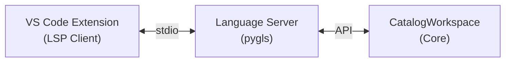

# :material-protocol: Language Server (LSP)

The backend provides a **Language Server** that communicates using the Language Server Protocol (LSP). This server powers the VS Code extension, providing real-time diagnostics and topology data as you type.

**Location:** `backend/app/catalog_language_server/`

---

## Architecture

The server uses the `pygls` library and runs over standard input/output (stdio).



The LSP server is a thin adapter over the `CatalogWorkspace`. It does not validate files itself — it passes file content to the workspace and converts the resulting diagnostics into LSP format.

---

<div class="grid cards" markdown>

-   :material-swap-horizontal:{ .lg .middle } **LSP Protocol Events**

    How the server handles standard LSP messages (open, change, close).

    [:octicons-arrow-right-24: Standard Protocol](protocol.md)

-   :material-call-made:{ .lg .middle } **Custom LSP Methods**

    Custom methods added for the topology webview and live updates.

    [:octicons-arrow-right-24: Custom Methods](custom-methods.md)

</div>

---

## Running the Server

You normally don't run the LSP server directly — the VS Code extension starts it for you automatically.

However, you can run it manually for testing:

```bash
python -m app.catalog_language_server
```

Because it uses `stdio` (standard input/output), it will block your terminal, waiting for JSON-RPC messages. To stop it, press ++ctrl+c++.
