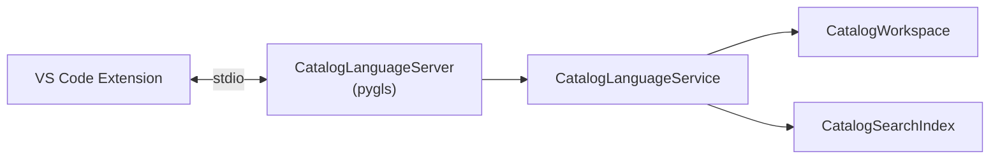

# :material-language-python: Language Server

`CatalogLanguageServer` cung cấp LSP (Language Server Protocol) diagnostics, completion, và topology cho VS Code Extension qua giao thức stdio.

-   :material-protocol: **Giao thức LSP**

    Standard LSP lifecycle events.

    [:octicons-arrow-right-24: Giao thức](protocol.md)

-   :material-puzzle: **Custom Methods**

    Các method mở rộng: topology, field edit, owners, relations.

    [:octicons-arrow-right-24: Custom Methods](custom-methods.md)

---

## :material-cog: Kiến trúc

| Thành phần | File | Vai trò |
|---|---|---|
| `CatalogLanguageServer` | `server.py` | pygls server, đăng ký LSP handlers |
| `CatalogLanguageService` | `service.py` | Business logic, case mapping (`snake_case` ↔ `camelCase`) |

---

## :material-key-variant: Đặc điểm chính

| Đặc điểm | Chi tiết |
|---|---|
| **Transport** | stdio (không mở port) |
| **Scope** | Một `CatalogScope` bao gồm tất cả workspace folders |
| **Document types** | Chỉ file `catalog-info.yaml` |
| **Debounce** | 300 ms cho unsaved document changes |
| **Completion** | Field keys, values, `EntityReference` targets |
| **Custom methods** | 11 custom methods cho topology, field edit, owners, relations |
