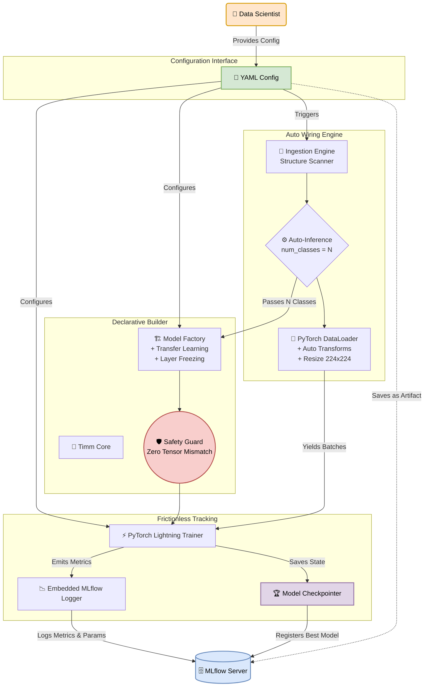

# CortexML System Architecture Document
**Phase 2 / MVP: The Training Pipeline**

---

## 1. Executive Summary
Sau khi hoàn thành xuất sắc Giai đoạn 1 (Data Ingestion Engine) với khả năng trích xuất và số hóa cấu trúc dữ liệu thành các siêu dữ liệu (`metadata.csv`), CortexML chính thức bước vào **Giai đoạn 2 (MVP): The Training Pipeline (Động cơ Huấn luyện)**. 

Tài liệu này phác thảo kiến trúc hệ thống chi tiết cho Giai đoạn 2. Mục tiêu tối thượng của kiến trúc này là hiện thực hóa triết lý **"Zero-Code / Config-Driven"**, giải phóng Data Scientist khỏi các lỗi kỹ thuật rườm rà (Tensor Shape Mismatch, Tracking thủ công) để họ tập trung 100% vào việc thiết kế cấu hình (Configuration).

---

## 2. Design Principles & Goals (Nguyên lý Thiết kế)

1. **Declarative First:** Toàn bộ hành vi của hệ thống (Mô hình gì, Augmentation ra sao, Freeze bao nhiêu layer) phải được định nghĩa thông qua file `config.yaml`.
2. **Auto-Wiring:** Tận dụng triệt để `metadata.csv` từ Giai đoạn 1 để tự động cấu hình các tham số nội bộ (đặc biệt là `num_classes`), loại bỏ hard-code.
3. **Frictionless Tracking:** Mọi vòng lặp huấn luyện đều mặc định được theo dõi. Không có metric nào bị bỏ sót, không có checkpoint nào bị ghi đè nhầm. Mọi thứ được đồng bộ minh bạch lên MLflow.
4. **Separation of Concerns (SoC):** Tách biệt rạch ròi giữa logic Khởi tạo dữ liệu (Dataloader), Khởi tạo Mô hình (Model Builder) và Vòng lặp Huấn luyện (Trainer).

---

## 3. Detailed Architecture (Kiến trúc Chi tiết - C4 Level 3)

Dưới đây là biểu đồ luồng hệ thống toàn cảnh. Nó thể hiện cách hệ thống biến một file YAML đơn giản thành một pipeline huấn luyện hoàn chỉnh, tự động hóa và an toàn tuyệt đối.

---

## 4. Component Breakdown (Phân rã Hệ thống Chi tiết)

Các khối thành phần (Component) trên biểu đồ được phân rã trách nhiệm cụ thể như sau:

### 4.1. Configuration Interface (Giao diện Cấu hình)
- **Thành phần biểu đồ:** `YAML Config`.
- **Công nghệ cốt lõi:** `Pydantic` hoặc `OmegaConf`.
- **Trách nhiệm:** 
  - Đọc và validate file `config.yaml`.
  - Báo lỗi fail-fast ngay từ giây đầu tiên nếu user điền sai cấu hình, thay vì đợi đến lúc train mới báo lỗi.
- **Output:** Một object `TrainingConfig` Immutable (không thể thay đổi) được chích (inject) vào mọi module bên dưới.

### 4.2. Auto Wiring Engine (Động cơ Nối ghép Tự động)
- **Thành phần biểu đồ:** `Ingestion Engine`, `MetaCalc`, `PyTorch DataLoader`.
- **Công nghệ cốt lõi:** `PyTorch Dataset` & `DataLoader`, `Albumentations` hoặc `Torchvision`.
- **Trách nhiệm:**
  - **Auto-Inference:** Đọc `metadata.csv` (được gen từ Phase 1), tự động đếm số lượng nhãn (Label) qua `MetaCalc` để nội suy ra `num_classes = N`.
  - **Dynamic Pipeline:** Dựa vào `config.yaml`, tự động áp dụng các phép biến đổi ảnh (Resize, Normalize) vào DataLoader.
- **Output:** Trả về `num_classes` (cho Model Builder) và các `DataLoader` (cho Trainer).

### 4.3. Declarative Builder (Trình đúc Mô hình)
- **Thành phần biểu đồ:** `Timm Core`, `Model Factory`, `Safety Guard`.
- **Công nghệ cốt lõi:** `timm` (PyTorch Image Models).
- **Trách nhiệm:**
  - **Shape Matcher (Chốt chặn An toàn):** Nhận `num_classes` từ Auto Wiring Engine, khởi tạo mô hình khớp 100% về kích thước Tensor, loại bỏ lỗi Mismatch.
  - **Transfer Learning & Layer Freezing:** Thực thi logic khóa cập nhật gradient đối với các layer cơ sở dựa trên thông số YAML.
- **Output:** Trả về một mô hình PyTorch (nn.Module) đã sẵn sàng huấn luyện.

### 4.4. Frictionless Tracking (Vòng lặp Theo dõi)
- **Thành phần biểu đồ:** `PyTorch Lightning Trainer`, `Embedded MLflow Logger`, `Model Checkpointer`.
- **Công nghệ cốt lõi:** `PyTorch Lightning (PL)`, `MLflow`.
- **Trách nhiệm:**
  - **Lifecycle Management:** PL Trainer bọc mô hình vào `LightningModule` và quản lý vòng đời Training/Validation.
  - **Frictionless Tracking:** `MLflow Logger` tự động gửi metrics (Loss, Accuracy) và system params lên giao diện MLflow UI.
  - **Artifact Archiving:** Bắt buộc lưu lại file `config.yaml` gốc đính kèm vào mỗi MLflow Run để đảm bảo **Tính Tái tạo 100% (Reproducibility)**.
  - **Smart Checkpoint:** Giám sát để chỉ giữ lại mô hình tốt nhất.

---

## 5. Interface Contracts (Giao thức Kết nối Phase 1 -> Phase 2)

Hệ thống Phase 2 hoàn toàn độc lập (Decoupled) với Phase 1. Chúng chỉ giao tiếp với nhau thông qua một "Bản hợp đồng Dữ liệu" (Data Contract):

- **Đầu vào (Input Contract):** 
  - Thư mục chứa ảnh vật lý.
  - File `metadata.csv` với định dạng bắt buộc: `[filepath, label, split]`.
- **Đầu ra (Output Contract):**
  - `<output_dir>/checkpoints/best_model.ckpt`
  - Khởi tạo thành công 1 MLflow Run chứa toàn bộ lịch sử (Loss/Metrics) và `config.yaml`.

---

## 6. Lộ trình Triển khai (Implementation Roadmap)
Để không bị ngợp, Phase 2 sẽ được code theo trình tự:
1. **Milestone 1:** Viết `Configuration Interface` (định nghĩa schema `config.yaml`).
2. **Milestone 2:** Viết `Auto Wiring Engine` (đọc `.csv`, tính `num_classes`, tạo `Dataloader`).
3. **Milestone 3:** Viết `Declarative Builder` (Bọc `timm` với `num_classes`).
4. **Milestone 4:** Tích hợp `Frictionless Tracking` (PL Trainer & MLflow).
5. **Milestone 5:** Viết E2E Integration Test cắm từ Phase 1 sang Phase 2.

## Keyword

- contexlib | contextmanger
- multiprocessing | Process
- asyncclient | asyncio
- asynchronous

